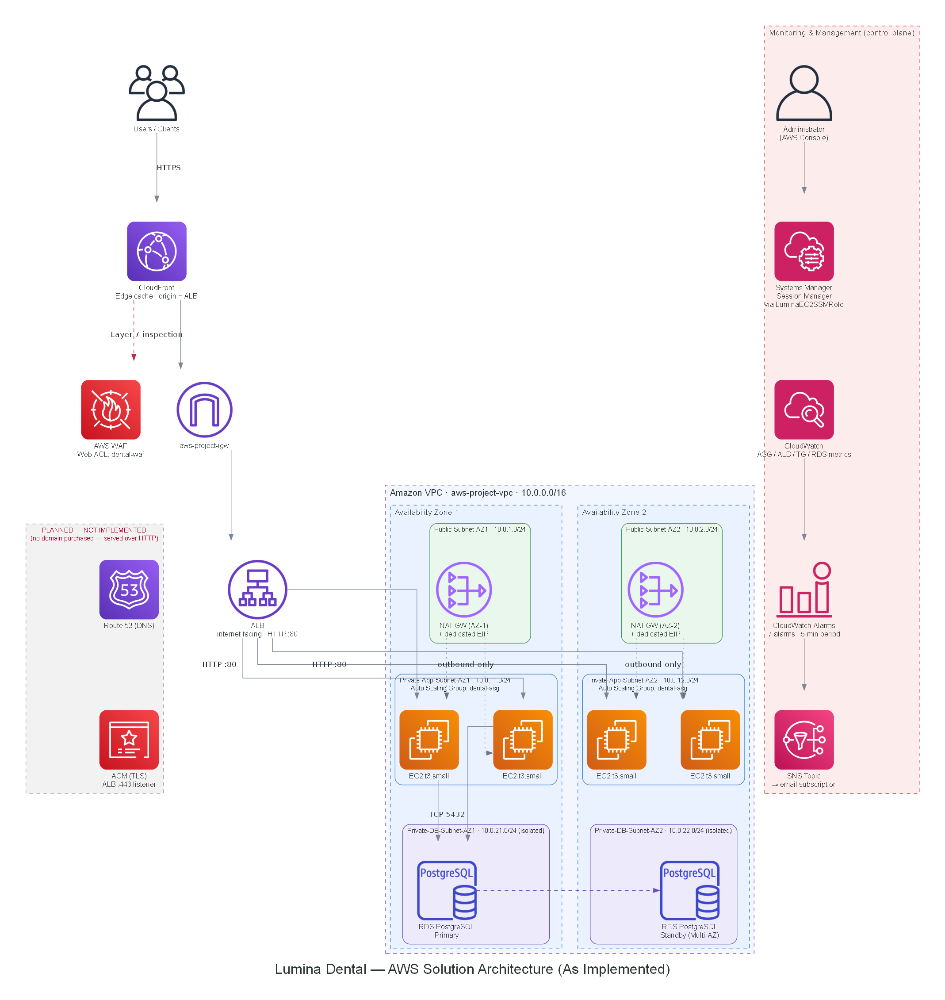

# Lumina Dental — AWS Scalable Web Application Architecture


A documented, evidence-audited reference architecture for deploying a **Next.js + FastAPI + PostgreSQL** web application on AWS as a highly available, horizontally scalable, multi-Availability-Zone system — built with an internet-facing Application Load Balancer, an Auto Scaling Group of EC2 instances, Amazon RDS PostgreSQL, CloudFront, AWS WAF, and Systems Manager Session Manager for SSH-free administration.

> **Documentation integrity.** Every claim in this repository is derived from the project's original build documentation, preserved unedited in [`docs/source-material/`](docs/source-material/). Nothing here describes a service, connection, or configuration that isn't supported by that evidence. Where a value was never recorded, the documentation says so explicitly (**"Not documented"**) instead of guessing. Components that were designed but never deployed — Route 53 and HTTPS — are labeled **planned, not implemented** everywhere they appear, including in the architecture diagram.

## Overview

Lumina Dental began as a conventional single-server web application: one EC2 instance running the reverse proxy, the frontend, the backend, and the database together. This project re-architects that application on AWS into a layered system that:

- **Survives the loss of a single server** — a minimum of two application instances, spread across two Availability Zones, with automatic replacement.
- **Scales horizontally under load** — an Auto Scaling Group grows from 2 to 6 instances based on CPU utilisation, with no manual intervention.
- **Keeps the database off the application servers** — Amazon RDS PostgreSQL is a separate, managed, Multi-AZ service that every application instance connects to over its stable endpoint.
- **Restricts the public attack surface to a single controlled entry point** — CloudFront and AWS WAF sit in front of an Application Load Balancer; EC2 instances and the database have no public IP addresses and no inbound SSH.
- **Removes SSH entirely** — administrative access to every instance is through AWS Systems Manager Session Manager, authorized by IAM rather than by a distributed key.

The application stack is **Next.js** (frontend), **FastAPI/Uvicorn** (backend API), and **Nginx** (reverse proxy), all three running together on every application server, which is built once as a validated "Golden AMI" and used, unmodified, by every instance the Auto Scaling Group launches.

## Architecture



_Editable source: [`docs/architecture/aws-architecture.drawio`](docs/architecture/aws-architecture.drawio) (open in [diagrams.net](https://app.diagrams.net)) · Vector: [`docs/architecture/aws-architecture.svg`](docs/architecture/aws-architecture.svg)_

Full architectural detail — including exact CIDR blocks, route tables, and the reasoning behind every major decision — is in **[`docs/architecture.md`](docs/architecture.md)**.

### Video walkthrough

The full console workflow — networking, compute, database, security, and monitoring — is documented in a recorded video rather than static screenshots. Click the thumbnail to watch:

[](https://drive.google.com/file/d/1U9iVSWNGE3MAy1IrROxxaNAWLucN7z9G/view?usp=sharing)

*(Hosted on Google Drive rather than committed to git — the raw file is 168 MB, over GitHub's 100 MB per-file push limit. See [`docs/video/README.md`](docs/video/README.md).)*

## Architecture flow

```
User
  → Amazon CloudFront (edge cache, origin = ALB)
    → AWS WAF (Layer 7 inspection — Web ACL: dental-waf)
      → Application Load Balancer (HTTP :80, internet-facing)
        → Target Group → Auto Scaling Group (EC2, 2–6 instances, 2 AZs)
          → Nginx :80 → Next.js :3000 (pages/static) OR FastAPI :8000 (127.0.0.1, /api/*)
            → Amazon RDS PostgreSQL :5432 (Multi-AZ, isolated private subnets)
```

- **Static requests** (JS/CSS/images/fonts) can be served directly from a CloudFront edge cache on a hit; on a miss, they pass through to the ALB and are potentially cached on return.
- **Dynamic and API requests** (`/api/*`) always pass through to the origin — they are not cached like static assets, since responses depend on session/user/database state.
- **Failed requests**: a request matching an AWS WAF block rule returns `HTTP 403` before reaching the ALB. A request routed to an unhealthy target never happens — the ALB excludes unhealthy instances from rotation based on Target Group health checks.
- **Scaling events**: CPU-based target tracking adds instances (up to 6) or removes them (never below 2); new instances self-register with the Target Group and only receive traffic once they pass health checks.
- **Database failover**: the application always addresses the RDS **service endpoint**, never an instance address, so a Multi-AZ failover (if enabled — see [verification note](docs/architecture.md#database-layer)) repoints the same endpoint to the promoted standby with no application-side change.

Full request-lifecycle diagram (sequence form): [`docs/architecture.md#request-lifecycle-as-implemented`](docs/architecture.md#request-lifecycle-as-implemented).

## AWS services used

| AWS Service               | Purpose                                  | Implementation                                                       |
| ------------------------- | ---------------------------------------- | -------------------------------------------------------------------- |
| Amazon VPC                | Network isolation                        | `aws-project-vpc`, `10.0.0.0/16`, 6 subnets / 2 AZs / 5 route tables |
| Internet Gateway          | Public subnet internet access            | `aws-project-igw`                                                    |
| NAT Gateway (×2)          | Outbound-only access for private subnets | One per AZ, zone-local routing, dedicated EIPs                       |
| Amazon EC2                | Application compute                      | `t3.small`, launched from a custom Golden AMI                        |
| EC2 Launch Template       | Standardized instance definition         | Custom AMI + `ec2-sg` + `LuminaEC2SSMRole` instance profile          |
| EC2 Auto Scaling Group    | Capacity management, self-healing        | `dental-asg`; min 2 / desired 2 / max 6; target tracking on CPU      |
| Application Load Balancer | Layer 7 public entry point               | Internet-facing, multi-AZ, HTTP :80                                  |
| ALB Target Group          | Target registration & health checks      | Instance type, HTTP:80, bound to the ASG                             |
| Amazon RDS (PostgreSQL)   | Managed relational database              | Private isolated subnets, TCP 5432, Multi-AZ as documented           |
| Amazon CloudFront         | Edge delivery & static caching           | Origin = ALB                                                         |
| AWS WAF                   | Layer 7 request inspection               | Web ACL `dental-waf`, 4 managed rule groups + 5 custom rules         |
| AWS Systems Manager       | SSH-free administrative access           | Session Manager via `LuminaEC2SSMRole`                               |
| AWS IAM                   | Least-privilege instance permissions     | `LuminaEC2SSMRole` + `AmazonSSMManagedInstanceCore`                  |
| Amazon CloudWatch         | Metrics & alarms                         | 7 alarms across ASG/ALB/Target Group/RDS                             |
| Amazon SNS                | Alarm notification delivery              | Topic → email subscription                                           |
| Security Groups           | Stateful tier-to-tier firewall           | `alb-sg` → `ec2-sg` → `rds-sg`, chained by reference                 |

_Planned but not deployed: **Amazon Route 53** and **AWS Certificate Manager** (no domain was purchased — the app is served over HTTP via the AWS-generated endpoint). Full table with rationale: [`docs/aws-services.md`](docs/aws-services.md)._

## Networking architecture

| Subnet                   | AZ   | CIDR           | Purpose                                   |
| ------------------------ | ---- | -------------- | ----------------------------------------- |
| `Public-Subnet-AZ1`      | AZ-1 | `10.0.1.0/24`  | NAT Gateway; ALB node                     |
| `Private-App-Subnet-AZ1` | AZ-1 | `10.0.11.0/24` | EC2 / Auto Scaling Group                  |
| `Private-DB-Subnet-AZ1`  | AZ-1 | `10.0.21.0/24` | Amazon RDS (isolated — no internet route) |
| `Public-Subnet-AZ2`      | AZ-2 | `10.0.2.0/24`  | NAT Gateway; ALB node                     |
| `Private-App-Subnet-AZ2` | AZ-2 | `10.0.12.0/24` | EC2 / Auto Scaling Group                  |
| `Private-DB-Subnet-AZ2`  | AZ-2 | `10.0.22.0/24` | Amazon RDS (isolated — no internet route) |

The database subnets' route tables carry **no internet route in either direction** — this is a routing-level control, independent of and in addition to security groups. Two NAT Gateways (one per AZ, zone-local routing) exist specifically so that a single AZ failure never removes outbound connectivity from the surviving AZ. Full detail: [`docs/architecture.md#networking-architecture`](docs/architecture.md#networking-architecture).

## Compute layer

Every application instance (`t3.small`) is launched from a single validated **Golden AMI** containing Nginx, Next.js, and FastAPI pre-installed and pre-configured — no bootstrap/User Data script runs at launch. This is what makes horizontal scaling safe: instance _n+1_ is guaranteed functionally identical to instance _n_, and a reboot test was performed before the AMI was captured specifically to confirm all three services restart unattended (required, since the Auto Scaling Group launches instances with no human present).

| Setting            | Value                                                              |
| ------------------ | ------------------------------------------------------------------ |
| Launch Template    | Custom AMI, `t3.small`, `ec2-sg`, IAM profile → `LuminaEC2SSMRole` |
| Auto Scaling Group | `dental-asg` — min **2** / desired **2** / max **6**               |
| Scaling policy     | Target Tracking on CPU utilisation                                 |

Full detail: [`docs/architecture.md#compute-layer`](docs/architecture.md#compute-layer) · [`docs/scalability-availability.md`](docs/scalability-availability.md)

## Load balancing

An internet-facing Application Load Balancer is the **only** public entry point for application traffic — EC2 instances have no public IP and accept traffic solely from the ALB's security group. Its HTTP:80 listener forwards to a Target Group of type `instance`, which is bound directly to the Auto Scaling Group so that registration and deregistration are fully automatic. No HTTPS listener exists yet (see [Security](#security)).

## Database layer

**Amazon RDS for PostgreSQL** runs in dedicated, isolated private subnets with a documented Multi-AZ primary/standby topology. The application connects to the RDS **service endpoint**, never a specific instance address — this is what allows a Multi-AZ failover to be transparent to the application, since RDS repoints the endpoint's DNS record to the promoted standby rather than requiring any configuration change. RDS is reachable only from `ec2-sg` on TCP 5432; there is no route from the internet to the database subnets in either direction. Full detail, including the verification caveat on Multi-AZ status: [`docs/architecture.md#database-layer`](docs/architecture.md#database-layer).

## CDN

**Amazon CloudFront** sits in front of the ALB (its configured origin) and caches static assets — JavaScript, CSS, images, fonts — at edge locations. Dynamic pages and `/api/*` requests are forwarded to the origin on every request rather than cached, since their responses depend on session and database state. Cache policy details (TTLs, cache keys) are not recorded in the source documentation.

## Security

Defense-in-depth across eight layers, from CloudFront down to application-level authentication/authorization/MFA. Security groups are chained by **reference**, not CIDR, so authorization follows group membership rather than IP address — critical in a fleet whose instance IPs change continuously under Auto Scaling:

```
Internet ──TCP 80──▶ alb-sg ──TCP 80 (from alb-sg)──▶ ec2-sg ──TCP 5432 (from ec2-sg)──▶ rds-sg
```

No EC2 instance or RDS resource has a public IP address; there is no inbound SSH rule anywhere; and administrative access is exclusively through **Systems Manager Session Manager** (see below). **AWS WAF** blocks SQL injection, common web exploits, and administrative-path scanning outright — validated live, with a `/admin` request returning `HTTP 403` and traced via WAF sampled requests to the exact matched rule. Three WAF rules (anti-DDoS, global rate limiting, body-size restriction) currently run in **COUNT mode only** — they are observed, not blocked. Client traffic is currently **unencrypted HTTP**, because no domain was purchased for an ACM certificate.

Full security model, the complete traffic matrix, the full WAF rule table, and prioritized recommendations: **[`docs/security.md`](docs/security.md)**.

## AWS WAF

Web ACL `dental-waf` combines 4 AWS managed rule groups (Common, SQLi, Admin Protection, Anti-DDoS) with 5 custom rules (IPv4/IPv6 allow/block lists, geographic restriction, global rate limiting, body-size restriction). A known, documented conflict exists: the Admin Protection rule currently blocks the application's own `/admin` panel, with a scoped IP-allowlist exception **planned but not yet implemented**. Full rule table, validation evidence, and the remediation plan: [`docs/security.md#aws-waf`](docs/security.md#aws-waf).

## Systems Manager

Every EC2 instance carries the IAM role `LuminaEC2SSMRole` (with the AWS-managed `AmazonSSMManagedInstanceCore` policy) via its instance profile, declared in the Launch Template — so every instance the Auto Scaling Group ever launches, including unattended replacements, is immediately manageable through **Session Manager** with zero manual setup. This requires only outbound HTTPS from the instance; no inbound port, key, or bastion host exists anywhere in the architecture. Verified via an interactive session (`hostname`, `whoami`, `sudo systemctl status nginx`, `sudo ss -tulpn`). Detail: [`docs/security.md#aws-systems-manager--no-inbound-ssh`](docs/security.md#aws-systems-manager--no-inbound-ssh).

## Monitoring and alerting

Seven CloudWatch alarms, all on a 5-minute evaluation period, across the Auto Scaling Group, the ALB, the Target Group, and RDS — all publishing to a single SNS topic with an email subscription:

| Metric                                   | Statistic | Condition   | Detects                                      |
| ---------------------------------------- | --------- | ----------- | -------------------------------------------- |
| ASG `GroupInServiceInstances`            | Minimum   | < 2         | Missing compute capacity                     |
| ALB `HTTPCode_ELB_4XX_Count`             | Sum       | > 5 / 5 min | Load-balancer–level client errors            |
| Target Group `HealthyHostCount`          | Minimum   | < 2         | Capacity that exists but can't serve traffic |
| Target Group `HTTPCode_Target_4XX_Count` | Sum       | > 5 / 5 min | Application-level client errors              |
| RDS `CPUUtilization`                     | Average   | > 80%       | Database compute pressure                    |
| RDS `DatabaseConnections`                | Average   | > 80        | Connection-pool pressure                     |
| RDS `FreeStorageSpace`                   | Minimum   | < 2 GB      | Impending storage exhaustion                 |

**Known gap:** no 5XX or latency alarms are configured, and no centralized logging exists — instance logs are lost when an instance is replaced. Full rationale for each metric/statistic choice and prioritized recommendations: [`docs/monitoring.md`](docs/monitoring.md).

## High availability

- **Multi-AZ everywhere**: the ALB, the Auto Scaling Group, and RDS (as documented) all span two Availability Zones.
- **No single points of failure inside the region**: two NAT Gateways (zone-local), a minimum of two application instances at all times, and automatic instance replacement on failure.
- **Health-based traffic exclusion**: the ALB stops routing to a failing instance within a few health-check cycles — before the Auto Scaling Group's slower, capacity-level replacement even begins.
- **Not covered**: multi-region failure, and (pending verification) protection against database data loss/corruption — see [`docs/scalability-availability.md#what-the-architecture-does-not-protect-against`](docs/scalability-availability.md#what-the-architecture-does-not-protect-against).

## Scalability

Horizontal scaling is fully automated (2–6 EC2 instances via CPU-based target tracking) and rests on three implementation choices: statelessness, the Golden AMI, and automatic Target Group registration. **The database is the architecture's real scalability ceiling** — a single writable RDS primary serves every application instance, with no read replicas, no caching layer, and no connection-pooling proxy. Full analysis: [`docs/scalability-availability.md`](docs/scalability-availability.md).

## Disaster recovery / resilience

The architecture is resilient to **infrastructure failure within a single AWS Region**: instance failure, Availability Zone failure, and (if Multi-AZ is confirmed enabled) database primary failure are all handled automatically. It has **no documented disaster-recovery plan beyond that**: no cross-region strategy, no documented RTO/RPO, and no confirmed backup/restore procedure for RDS. This repository does not claim a complete DR strategy exists, because the source material does not describe one. See [`docs/scalability-availability.md#what-the-architecture-does-not-protect-against`](docs/scalability-availability.md#what-the-architecture-does-not-protect-against).

## Cost considerations

No pricing data is recorded in the project documentation except one AWS-displayed estimate: **AWS WAF at approximately $42–$43 per 10 million requests/month**. No other figures are invented anywhere in this repository. What can be stated accurately is the cost _shape_: the bill is dominated by **fixed, availability-driven costs** — two NAT Gateways, a Multi-AZ RDS standby, the ALB, and a baseline of two always-on EC2 instances — rather than by traffic volume. Every one of those fixed costs is a deliberate redundancy decision recorded in the build documentation, not incidental spend. Full breakdown: [`docs/architecture.md#cost-considerations-summary`](docs/architecture.md#cost-considerations-summary).

## Deployment

This project was built **manually through the AWS Console** — there is no Infrastructure-as-Code and no CI/CD pipeline in the source material. The full, phase-by-phase console workflow actually followed (application prep → AMI → networking → security groups → Launch Template → ALB/Target Group → Auto Scaling Group → Systems Manager → CloudFront → WAF → monitoring), plus the fully specified (but not yet executed) steps to complete the HTTPS chain, is documented in **[`docs/deployment.md`](docs/deployment.md)**.

## Verification / testing

Documented, actually-performed checks include: backend/frontend health checks, an unattended reboot test (required before the AMI could be trusted as a scaling source), application access validated through the ALB, SSM Agent and Session Manager connectivity, and two live WAF validations (a blocked `/admin` request traced to its exact matching rule, and an observed internet scanner correctly allowed through). Auto Scaling under real load, RDS failover, and CloudWatch alarm firing are **not** documented as tested — see the full table and suggested safe-verification methods in [`docs/deployment.md#verification--testing-performed`](docs/deployment.md#verification--testing-performed) and [`docs/troubleshooting.md`](docs/troubleshooting.md).

## Screenshots

No static screenshots are included — see [Video walkthrough](#video-walkthrough) above. The suggested folder layout for screenshots, if any are extracted from the video later, is in [`docs/screenshots/README.md`](docs/screenshots/README.md).

## Project structure

```
.
├── README.md
├── LICENSE
├── .gitignore
└── docs/
    ├── architecture.md
    ├── aws-services.md
    ├── security.md
    ├── monitoring.md
    ├── scalability-availability.md
    ├── deployment.md
    ├── troubleshooting.md
    ├── project-structure.md
    ├── demo-script.md
    ├── architecture/
    │   ├── aws-architecture.png
    │   ├── aws-architecture.svg
    │   ├── aws-architecture.drawio
    │   └── original-target-diagram.png
    ├── screenshots/
    ├── video/
    │   └── aws-project-walkthrough.mp4   # gitignored — hosted externally, see docs/video/README.md
    └── source-material/
        ├── project-doc-raw.md
        └── architecture-report-full.md
```

Full explanation of each path: [`docs/project-structure.md`](docs/project-structure.md).

## Documentation index

| Document                                                             | Contents                                                                                                  |
| -------------------------------------------------------------------- | --------------------------------------------------------------------------------------------------------- |
| [docs/architecture.md](docs/architecture.md)                         | Complete architecture: networking, compute, database, CDN, request flow, documented diagram discrepancies |
| [docs/aws-services.md](docs/aws-services.md)                         | Every AWS service used, plus what was planned but not deployed                                            |
| [docs/security.md](docs/security.md)                                 | Defense-in-depth, security groups, WAF rules, Systems Manager, IAM, gaps and recommendations              |
| [docs/monitoring.md](docs/monitoring.md)                             | CloudWatch alarms, SNS, alerting lifecycle, coverage gaps                                                 |
| [docs/scalability-availability.md](docs/scalability-availability.md) | Auto Scaling, HA mechanisms, full failure-scenario catalog, real scaling constraints                      |
| [docs/deployment.md](docs/deployment.md)                             | Actual build sequence, prerequisites, the HTTPS chain not yet executed, verification performed            |
| [docs/troubleshooting.md](docs/troubleshooting.md)                   | Operational workflow, alarm response, configuration values worth confirming                               |
| [docs/demo-script.md](docs/demo-script.md)                           | Walkthrough sequence covered by the recorded video                                                        |
| [docs/video/README.md](docs/video/README.md)                         | Recorded video walkthrough — hosting link and status                                                      |
| [docs/source-material/](docs/source-material/)                       | Original, unedited build notes and the full evidence-audited architecture report                          |

## License

Documentation and diagrams in this repository are licensed under the [MIT License](LICENSE). No application source code is included.
