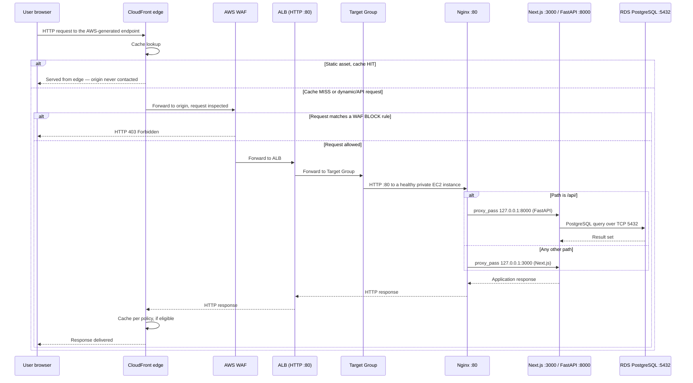

# Architecture

This document describes the AWS architecture actually deployed for Lumina Dental, as recorded in the project's build documentation (see [`docs/source-material/project-doc-raw.md`](source-material/project-doc-raw.md)) and cross-checked against the architecture diagram. A full, section-by-section evidence audit — including every discrepancy between the diagram and the deployment — is preserved in [`docs/source-material/architecture-report-full.md`](source-material/architecture-report-full.md). This document is the condensed, authoritative summary; where the two disagree in emphasis, this file reflects the corrected, evidence-checked view.

> **Evidence rule.** Every value below (CIDR blocks, resource names, capacity numbers, alarm thresholds) is taken directly from the project documentation. Where a setting was not recorded, it is marked **Not documented** rather than assumed.

## System overview

Lumina Dental is a web application consisting of a **Next.js** frontend, a **FastAPI** backend, and an **Nginx** reverse proxy, all three running together on every application server. The database, **Amazon RDS for PostgreSQL**, is external to the compute tier. The project replaces a single-server deployment model with a layered AWS architecture that separates:

1. A public edge/entry layer (CloudFront, WAF, Application Load Balancer)
2. A private, horizontally scalable compute layer (EC2 behind an Auto Scaling Group)
3. A private, isolated data layer (RDS PostgreSQL, Multi-AZ)
4. A monitoring/management plane that does not carry user traffic (CloudWatch, SNS, Systems Manager)

The architectural goal was to make the application **survive the loss of a single server**, **scale horizontally under load**, **keep the database off the application servers**, and **restrict the public attack surface to a single controlled entry point** — while keeping every application server disposable and identical.

## Solution diagram

Editable source: [`architecture/aws-architecture.drawio`](architecture/aws-architecture.drawio) (open in [diagrams.net](https://app.diagrams.net)) · Vector: [`architecture/aws-architecture.svg`](architecture/aws-architecture.svg)

The original diagram produced during the project is kept for reference at [`architecture/original-target-diagram.png`](architecture/original-target-diagram.png). It includes Route 53 and an implied HTTPS path, both of which the build documentation records as **planned but not deployed** — the diagram above corrects for this and reflects the as-built system. See [Known documentation discrepancies](#known-documentation-discrepancies) below.

## Layered view

| Layer | Components | Scope |
|---|---|---|
| Edge | Amazon CloudFront, AWS WAF | Global / outside the VPC |
| Public entry | Application Load Balancer, Internet Gateway | Public subnets, both AZs |
| Compute | EC2 (Launch Template + Auto Scaling Group) | Private application subnets, both AZs |
| Data | Amazon RDS for PostgreSQL (Multi-AZ) | Private, isolated database subnets, both AZs |
| Management/observability | CloudWatch, CloudWatch Alarms, SNS, Systems Manager | Control plane — no presence in the request path |

## Networking architecture

### VPC and subnets

| Property | Value |
|---|---|
| VPC name | `aws-project-vpc` |
| CIDR block | `10.0.0.0/16` |
| Availability Zones | 2 |
| Subnets | 6 (one public, one private-application, one private-database per AZ) |
| Internet Gateway | `aws-project-igw`, attached to the VPC |
| NAT Gateways | `nat-gateway-az1`, `nat-gateway-az2` — one per AZ, each with a dedicated Elastic IP |
| Route tables | 5 — `public-rt`, `private-app-rt-az1`, `private-app-rt-az2`, `private-db-rt-az1`, `private-db-rt-az2` |
| AWS Region | **Not explicitly documented.** An illustrative ALB DNS example uses `eu-north-1`, but this appears in a worked example rather than as a recorded configuration value. |

| Subnet | AZ | CIDR | Tier | Purpose |
|---|---|---|---|---|
| `Public-Subnet-AZ1` | AZ-1 | `10.0.1.0/24` | Public | NAT Gateway; ALB node |
| `Private-App-Subnet-AZ1` | AZ-1 | `10.0.11.0/24` | Private | EC2 / Auto Scaling Group |
| `Private-DB-Subnet-AZ1` | AZ-1 | `10.0.21.0/24` | Private, isolated | Amazon RDS |
| `Public-Subnet-AZ2` | AZ-2 | `10.0.2.0/24` | Public | NAT Gateway; ALB node |
| `Private-App-Subnet-AZ2` | AZ-2 | `10.0.12.0/24` | Private | EC2 / Auto Scaling Group |
| `Private-DB-Subnet-AZ2` | AZ-2 | `10.0.22.0/24` | Private, isolated | Amazon RDS |

### Route tables — what actually makes a subnet "public" or "private"

A subnet is public only because its route table has a default route to the Internet Gateway. This is the concrete mechanism, not a label:

| Route table | Subnets | Routes | Posture |
|---|---|---|---|
| `public-rt` | Both public subnets | `10.0.0.0/16 → local`, `0.0.0.0/0 → IGW` | Bidirectional internet reachability |
| `private-app-rt-az1` | `Private-App-Subnet-AZ1` | `10.0.0.0/16 → local`, `0.0.0.0/0 → NAT GW AZ-1` | Outbound-only |
| `private-app-rt-az2` | `Private-App-Subnet-AZ2` | `10.0.0.0/16 → local`, `0.0.0.0/0 → NAT GW AZ-2` | Outbound-only |
| `private-db-rt-az1` | `Private-DB-Subnet-AZ1` | `10.0.0.0/16 → local` only | No internet path in either direction |
| `private-db-rt-az2` | `Private-DB-Subnet-AZ2` | `10.0.0.0/16 → local` only | No internet path in either direction |

The database route tables **intentionally omit** any `0.0.0.0/0` route, to either the NAT Gateway or the Internet Gateway. This means that even if the RDS security group were misconfigured, there is no network path by which internet traffic could reach or leave the database subnets — routing and security groups are independent, reinforcing controls, not two expressions of the same one.

### NAT Gateway design — one per Availability Zone

Two NAT Gateways were deployed rather than one, each in its own AZ, and each AZ's private route table points only at its own zone's NAT Gateway. A single shared NAT Gateway would be cheaper but would create a cross-AZ dependency: if the zone hosting it failed, the *other*, healthy zone would also lose outbound connectivity — including the connectivity Systems Manager depends on. Paying for a second NAT Gateway removes that dependency and is the most expensive availability decision in this design (see [Cost Considerations](#cost-considerations-summary)).

NAT Gateways provide **outbound-initiated connectivity only**; they accept no unsolicited inbound connections, and, being an AWS-managed service rather than an EC2 resource, they carry no security group of their own — their behavior is governed entirely by route tables and by the security groups of the resources that use them.

## Compute layer

### Deployment model: Golden AMI + Launch Template + Auto Scaling Group

A single EC2 instance was manually provisioned and configured with the full application stack, validated, and then captured as a custom AMI ("Golden AMI"). This AMI is the source image for a Launch Template, which the Auto Scaling Group uses to launch every application instance. The database was moved off this instance entirely and lives only in RDS — the AMI therefore carries **no state**, and any instance the ASG launches from it is functionally identical to any other.

Validation performed before capturing the AMI:
- Backend health check: `curl http://127.0.0.1:8000` → `{"status":"ok","service":"Lumina Dental API"}`
- Frontend reachable through the instance's public IP
- Full request path confirmed end-to-end: browser → Nginx → Next.js/FastAPI → RDS
- **Reboot test**: the instance was rebooted and Nginx, Next.js and FastAPI/Uvicorn all restarted successfully without manual intervention — this is what qualifies the instance as a scaling source, since an Auto Scaling Group launches instances unattended.

### Launch Template

| Setting | Value |
|---|---|
| AMI | Custom application AMI (Golden Image) |
| Instance type | `t3.small` |
| Security Group | `ec2-sg` |
| IAM instance profile | Carries `LuminaEC2SSMRole` |
| Network placement | Subnets selected by the Auto Scaling Group (private application subnets, both AZs) |
| Storage | AMI-based root EBS volume |
| User Data | **Not used** — the application environment is fully baked into the AMI; no bootstrap script is required or documented |

### Auto Scaling Group

| Setting | Value |
|---|---|
| Name (referenced in CloudWatch config) | `dental-asg` |
| Minimum capacity | **2** |
| Desired capacity | **2** |
| Maximum capacity | **6** |
| Availability Zones | Both configured AZs |
| Target Group | The application Target Group (below) |
| Scaling policy | Target Tracking on CPU utilisation |
| Target CPU value | **Not documented** |
| Health check type (`EC2` vs `ELB`) | **Not documented** — operationally significant; see [Scalability & Availability](scalability-availability.md) |

Minimum 2 means the fleet is never running on a single instance under normal operation — a single-instance failure is a capacity event, not an availability event. Maximum 6 bounds both automatic scale-out and cost.

## Load balancing

An **Application Load Balancer** (Layer 7, internet-facing, deployed across both AZs) is the single public entry point for application traffic.

| Setting | Value |
|---|---|
| Listener | HTTP :80 only — **no HTTPS listener exists** (no ACM certificate, because no domain was purchased) |
| Target Group type | Instance |
| Target Group protocol/port | HTTP / 80 |
| Health checks | Enabled, protocol HTTP |
| Health check path | **Not documented** |
| Health check thresholds/interval | **Not documented** |

The Target Group is bound directly to the Auto Scaling Group: instances are registered automatically on launch and deregistered automatically on termination, so the Target Group's membership always mirrors the ASG's current membership — no manual target management occurs. The ALB, Target Group and ASG are deliberately decoupled and interact only through the Target Group, which is what allows instance count to change continuously with no load balancer reconfiguration.

## Database layer

**Amazon RDS for PostgreSQL**, listening on TCP `5432`, is deployed in the two private, isolated database subnets — one primary, one Multi-AZ standby.

| Property | Value |
|---|---|
| Engine | PostgreSQL |
| Port | 5432 |
| Placement | `Private-DB-Subnet-AZ1` / `Private-DB-Subnet-AZ2` |
| Topology | Primary + synchronous standby (Multi-AZ), as documented and diagrammed |
| Instance class, storage, engine version, backup retention | **Not documented** |

The application connects to the **RDS service endpoint**, never to a specific instance address. This is what makes failover transparent: on a Multi-AZ failover, RDS repoints the endpoint's DNS record to the promoted standby, and the application reconnects without any configuration change. The standby takes no read traffic under normal operation — it exists purely to be promoted.

> **Verification note.** Multi-AZ is documented and diagrammed consistently throughout the project material, but no explicit console confirmation (e.g., a screenshot of the Multi-AZ setting, or a failover test) is recorded. Section 22 of the full report lists this as a one-field check worth confirming before relying on it operationally.

Full detail, including the security-group model for database access, is in [`docs/security.md`](security.md).

## CDN — Amazon CloudFront

CloudFront is configured with the **Application Load Balancer as its origin**; it never connects to EC2 instances directly.

- **Cache hit** — the object is served from the edge location; the ALB is never contacted.
- **Cache miss** — the request is forwarded to the ALB, which applies its listener rules and Target Group health-based routing exactly as for any other request.
- **What is cached**: static assets — JavaScript, CSS, images, fonts.
- **What is not cached like static assets**: dynamic application pages and `/api/` requests, because their responses depend on the current user, session, or database state.
- Cache policy, TTLs, cache keys, and invalidation procedure: **not documented**.

## Request lifecycle (as implemented)

**On-instance routing.** Nginx is the only process on each instance listening on an externally reachable interface (`0.0.0.0:80`). Its configuration (`/etc/nginx/conf.d/lumina.conf`, loaded automatically via `include` in `nginx.conf`) defines exactly two location blocks:

| Location | Proxies to | Serves |
|---|---|---|
| `/` | `http://127.0.0.1:3000` | Next.js — pages and static assets |
| `/api/` | `http://127.0.0.1:8000/` | FastAPI via Uvicorn — API requests |

FastAPI/Uvicorn binds to `127.0.0.1:8000` (loopback only), so the API process is unreachable from outside the instance at the operating-system level, independent of any security group. Both the frontend and the API are published through a single public origin and port, so the client never addresses `:3000` or `:8000` directly, and the ALB only ever needs to know about port 80.

**Failed requests.** A request blocked by AWS WAF returns HTTP 403 before it reaches the ALB path (demonstrated in testing — see [`docs/security.md`](security.md)). A request to an unhealthy target never happens — the ALB excludes unhealthy targets from rotation based on Target Group health checks before any user traffic is sent to them.

**Scaling events and database failover** are covered in [`docs/scalability-availability.md`](scalability-availability.md).

## Control plane vs. data plane

| | Data plane | Control plane |
|---|---|---|
| Traffic | End-user HTTP requests/responses | Administrative and management operations |
| Path | CloudFront → WAF → ALB → Target Group → EC2 → RDS | AWS Console → Systems Manager → Session Manager → SSM Agent → EC2 |
| Authorization | WAF rules, security groups, application auth | IAM (`LuminaEC2SSMRole`, console identity permissions) |

This separation is structural: a compromise of the web application does not by itself yield administrative access, and administrative access does not depend on the web tier being reachable. CloudWatch metric collection, SNS delivery, Auto Scaling actions, and RDS failover are all control-plane operations that occur through AWS service APIs rather than through the application's network path.

## Known documentation discrepancies

Recorded rather than silently resolved, since the original diagram and the build documentation disagree on a few points:

1. **Route 53 / HTTPS.** The original diagram shows Route 53 as the DNS entry point ahead of CloudFront, implying an HTTPS path. The build documentation is explicit and repeated: no domain was purchased, so Route 53, the ACM certificate, and the ALB HTTPS listener were never deployed. The application is served over plain HTTP via the AWS-generated ALB/CloudFront endpoint. **This repository's corrected diagram excludes Route 53 and HTTPS from the "as implemented" path and marks them explicitly as planned.**
2. **RDS engine label.** The original diagram labels the database "MySQL / PostgreSQL" (a generic template placeholder). The documentation is unambiguous throughout: the engine is **PostgreSQL**, and FastAPI is configured against a PostgreSQL connection string on port 5432.
3. **WAF association point.** The diagram draws WAF attached to CloudFront (implying a global Web ACL); the narrative documentation describes WAF as positioned "before the Application Load Balancer" and the recorded evidence (a scanner request and a blocked `/admin` request, both observed at the ALB) is more consistent with a regional Web ACL on the ALB. The exact association is **not stated explicitly** in the source material. This matters operationally: if the Web ACL is attached only to CloudFront, and `alb-sg` still accepts port 80 from `0.0.0.0/0`, a client that discovers the ALB's DNS name directly could bypass WAF entirely. See the recommendation to restrict ALB ingress to CloudFront in [`docs/security.md`](security.md).
4. **Network ACLs.** The diagram's security legend claims "NACLs for subnet-level control," but no NACL rules, names, or subnet associations appear anywhere in the build documentation. Whether custom NACLs exist cannot be determined from the available material.

## Cost considerations (summary)

No cost estimate or billing data is recorded in the project documentation, with one exception: AWS displayed an estimated **AWS WAF cost of approximately $42–$43 per 10 million requests/month**. No other prices are stated anywhere in this repository, because none are supported by source evidence.

What can be said accurately is the *shape* of the cost:

- **Fixed, traffic-independent costs**: two NAT Gateways (frequently the largest single line item in architectures of this shape), a Multi-AZ RDS instance (the standby is billed while serving no traffic), the ALB, and a minimum of two always-on `t3.small` EC2 instances.
- **Variable, traffic-scaling costs**: CloudFront data transfer and requests, AWS WAF per-request inspection, EC2 scale-out above the baseline of 2 (up to 6), NAT Gateway data processing.
- **Minor costs**: seven CloudWatch alarms, SNS email delivery, AMI/EBS snapshot storage.

The architecture's cost is dominated by fixed, availability-driven components rather than by traffic — every one of the expensive fixed items (second NAT Gateway, Multi-AZ standby, baseline of two instances) is a deliberate redundancy decision, not waste.

## Further reading

- [AWS Services Used](aws-services.md)
- [Security Architecture](security.md)
- [Scalability & High Availability](scalability-availability.md)
- [Monitoring & Alerting](monitoring.md)
- [Deployment Procedure](deployment.md)
- [Full evidence-audited architecture report](source-material/architecture-report-full.md) — the complete, exhaustive version of this document with architecture decision records, a full failure-scenario catalog, and a line-by-line diagram/documentation cross-check
