# Deployment Procedure

## How this project was actually deployed

The project's build documentation records a **manual, AWS Console–driven deployment**. No Infrastructure-as-Code (CloudFormation, CDK, Terraform) and no CI/CD pipeline is documented anywhere in the source material. The procedure below is reconstructed directly from the recorded build sequence in [`docs/source-material/project-doc-raw.md`](source-material/project-doc-raw.md) — it is not a generic AWS tutorial, and no step is invented.

If you are reproducing this architecture, treat the phases below as the actual console workflow that was followed, in order.

## Prerequisites

- An AWS account with permissions to create: VPC resources (subnets, route tables, gateways), EC2 (instances, AMIs, Launch Templates, Auto Scaling Groups), Elastic Load Balancing (ALB, Target Groups), RDS, CloudFront, WAF, IAM (roles/instance profiles), Systems Manager, CloudWatch, and SNS.
- IAM permissions sufficient to create and attach the `AmazonSSMManagedInstanceCore` managed policy to a new role.
- No custom domain is required to reproduce the deployment as it currently stands (the project runs on the AWS-generated ALB/CloudFront endpoint). A domain **is** required to complete the HTTPS chain described at the end of this document.

## Phase 1 — Application server preparation (pre-AMI)

A single EC2 instance was provisioned and configured with the complete application stack:

- Next.js frontend (production build)
- FastAPI backend, running under a Python virtual environment via Uvicorn
- Nginx as reverse proxy
- Application dependencies, configuration, and environment variables
- Connectivity configuration to Amazon RDS PostgreSQL

## Phase 2 — Database migration to RDS

The database was moved off the instance to Amazon RDS PostgreSQL. The backend was configured to connect to the RDS endpoint on port 5432 using:

```
DATABASE_HOST=<RDS_ENDPOINT>
DATABASE_PORT=5432
DATABASE_NAME=<DATABASE_NAME>
DATABASE_USER=<DATABASE_USER>
DATABASE_PASSWORD=<DATABASE_PASSWORD>
```

This is the step that makes the instance stateless and everything that follows possible. (Note: in the current deployment these values are supplied via configuration baked into the AMI, not a secrets service — see [`docs/security.md`](security.md#what-is-not-managed-by-a-secrets-service).)

## Phase 3 — Nginx routing configuration

`/etc/nginx/conf.d/lumina.conf` was created with two location blocks (loaded automatically via the `include /etc/nginx/conf.d/*.conf;` directive in `nginx.conf`):

```nginx
location / {
    proxy_pass http://127.0.0.1:3000;   # Next.js
}

location /api/ {
    proxy_pass http://127.0.0.1:8000/;  # FastAPI via Uvicorn
}
```

## Phase 4 — Pre-AMI validation

```bash
curl http://127.0.0.1:8000
# {"status":"ok","service":"Lumina Dental API"}
```

The frontend was confirmed reachable through the instance's public IP, and the full path — browser → Nginx → Next.js/FastAPI → RDS — was confirmed end to end. Listening sockets were confirmed on 80, 3000, and 8000.

## Phase 5 — Reboot test

The instance was rebooted, and Nginx, Next.js, and FastAPI/Uvicorn were all confirmed to restart successfully **without manual intervention**. This step is what qualifies the instance to become a Golden AMI: an Auto Scaling Group launches instances unattended, so any process that only starts because an engineer typed a command would leave every future auto-launched instance permanently unhealthy.

## Phase 6 — Networking build-out

- VPC `aws-project-vpc` (`10.0.0.0/16`)
- 6 subnets across 2 AZs (see [`docs/architecture.md`](architecture.md#vpc-and-subnets) for the full CIDR table)
- Internet Gateway `aws-project-igw`, attached to the VPC
- NAT Gateways `nat-gateway-az1` and `nat-gateway-az2`, each with a dedicated Elastic IP, one per public subnet
- 5 route tables with their subnet associations (`public-rt`, `private-app-rt-az1/az2`, `private-db-rt-az1/az2`)

## Phase 7 — Security groups

`alb-sg`, `ec2-sg`, and `rds-sg` created and chained by security-group reference (not CIDR). SSH and any direct internet access to the compute and database tiers were deliberately omitted from the start. Full rule set in [`docs/security.md`](security.md#security-group-chain).

## Phase 8 — Golden AMI creation

The validated instance from Phases 1–5 was captured as the custom application AMI.

## Phase 9 — Launch Template

Created from the AMI with:
- Instance type `t3.small`
- Security group `ec2-sg`
- IAM instance profile carrying `LuminaEC2SSMRole`

## Phase 10 — Target Group and Application Load Balancer

- Target Group created: type instance, protocol HTTP, port 80, health checks enabled.
- Application Load Balancer created: internet-facing, HTTP listener on port 80, forwarding to the Target Group.

## Phase 11 — Auto Scaling Group

Created against the Launch Template with minimum 2 / desired 2 / maximum 6, associated with the private application subnets in both AZs and with the Target Group, and configured with a target-tracking scaling policy on CPU utilisation. Application access was then tested **through the ALB**, not the direct EC2 public IP.

## Phase 12 — Systems Manager

- IAM role `LuminaEC2SSMRole` created with the `AmazonSSMManagedInstanceCore` managed policy, attached via the Launch Template's instance profile.
- SSM Agent status verified on the instance.
- Instance confirmed **Online** under Systems Manager → Managed Nodes.
- An interactive Session Manager session opened and validated.

## Phase 13 — CloudFront

Distribution created with the ALB as origin; static content cached, dynamic/API requests forwarded to the origin on every request.

## Phase 14 — AWS WAF

Web ACL configured with the 4 managed rule groups and 5 custom rules described in [`docs/security.md`](security.md#aws-waf); behavior validated through WAF sampled requests, including the `/admin` block and the observed scanner traffic.

## Phase 15 — Monitoring

SNS topic created with an email subscription; 7 CloudWatch alarms configured across the ASG, ALB, Target Group, and RDS, all publishing to the topic. Full detail in [`docs/monitoring.md`](monitoring.md).

## Deployment lifecycle for application changes

No automated pipeline is documented — this is the manual process implied by the AMI-based model:

```mermaid
flowchart LR
    A[Change application code] --> B[Update a source instance<br/>and validate]
    B --> C[Create new AMI]
    C --> D[New Launch Template version]
    D --> E[Point ASG at the new version]
    E --> F[Replace instances<br/>e.g. instance refresh]
    F --> G[New instances register<br/>with Target Group]
    G --> H[Health checks pass]
    H --> I[ALB routes to new version]
```



## Completing the HTTPS chain (not yet executed)

This is the fully specified, documented plan for closing the transport-security gap described in [`docs/security.md`](security.md#transport-security). **None of these steps have been executed** — the project was intentionally stopped before this point because no domain was purchased.

1. Purchase a domain.
2. Create a Route 53 Hosted Zone for the domain.
3. If the domain is registered elsewhere, delegate its nameservers to Route 53.
4. Create an Alias A record pointing the domain (and `www`) at the ALB. (An Alias record is used rather than a CNAME because a CNAME cannot be created at a zone apex, while a Route 53 Alias record can point a root domain directly at an AWS resource.)
5. Request a public ACM certificate for the domain (optionally with a wildcard).
6. Validate the certificate via DNS — automatic if Route 53 holds the zone.
7. Attach the validated certificate to a new ALB HTTPS listener on port 443.
8. Reconfigure the existing HTTP :80 listener to redirect to HTTPS :443.
9. Test that `http://<domain>` redirects to `https://<domain>` and that the certificate is trusted by the browser.

The resulting flow would be:

```
https://<domain> → Route 53 (DNS resolution) → ALB :443 (TLS via ACM) → WAF → Target Group → EC2 → RDS
```

## Verification / testing performed

These are the checks the build documentation actually records as having been performed — not a generic test plan:

| Check | Method | Result |
|---|---|---|
| Backend health | `curl http://127.0.0.1:8000` | `{"status":"ok","service":"Lumina Dental API"}` |
| Frontend reachability | Browser via instance public IP (pre-ALB) | Confirmed |
| Full request path | Browser → Nginx → Next.js/FastAPI → RDS | Confirmed end to end |
| Service resilience | Reboot test | Nginx, Next.js, FastAPI/Uvicorn all restarted unattended |
| Application access via ALB | Browser via ALB DNS name (post-Auto Scaling Group) | Confirmed working, replacing direct EC2 public-IP access |
| SSM Agent status | `sudo systemctl status amazon-ssm-agent` | `Active: active (running)` |
| Systems Manager registration | AWS Console → Systems Manager → Managed Nodes | `Ping Status: Online` |
| Session Manager connectivity | Interactive session; `hostname`, `whoami`, `pwd`, `uname -a` | Confirmed shell access with no SSH |
| WAF admin-path blocking | `GET /admin` | `HTTP 403`, traced via WAF sampled requests to `AdminProtection_URIPATH` |
| WAF live-traffic inspection | Observed automated scanner request | `ALLOW`ed correctly (URI matched no block rule); confirmed WAF is actively inspecting real traffic |

**Not documented as tested:** Auto Scaling scale-out/scale-in under real load, RDS Multi-AZ failover, CloudWatch alarm firing under a real fault condition, and CloudFront cache-hit behavior. These remain **recommended verification steps** rather than confirmed results — see [`docs/troubleshooting.md`](troubleshooting.md) for how to exercise them safely.
