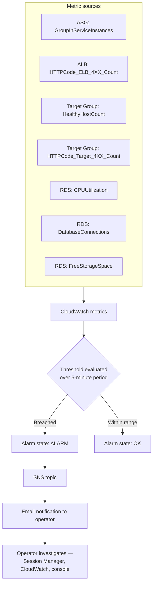

# Monitoring & Alerting

## Overview

```
CloudWatch Metrics → CloudWatch Alarms → SNS Topic → Email notification
```

Amazon CloudWatch collects metrics from four AWS services — the Auto Scaling Group, the Application Load Balancer, the ALB Target Group, and Amazon RDS. Seven alarms evaluate those metrics against fixed thresholds, all using a **5-minute period**, and all publish to a single **Amazon SNS** topic with an **email** subscription.

## Configured alarms

| # | Service | Metric | Statistic | Period | Condition |
|---|---|---|---|---|---|
| 1 | Auto Scaling Group | `GroupInServiceInstances` | Minimum | 5 min | **< 2** |
| 2 | Application Load Balancer | `HTTPCode_ELB_4XX_Count` | Sum | 5 min | **> 5** |
| 3 | Target Group | `HealthyHostCount` | Minimum | 5 min | **< 2** |
| 4 | Target Group | `HTTPCode_Target_4XX_Count` | Sum | 5 min | **> 5** |
| 5 | Amazon RDS | `CPUUtilization` | Average | 5 min | **> 80%** |
| 6 | Amazon RDS | `DatabaseConnections` | Average | 5 min | **> 80** |
| 7 | Amazon RDS | `FreeStorageSpace` | Minimum | 5 min | **< 2,147,483,648 bytes (2 GB)** |

## Why these metrics and statistics — the reasoning is deliberate

- **`GroupInServiceInstances` (Minimum < 2).** An ASG-level metric rather than a per-instance one, so it stays valid across instance replacement — it doesn't break when the instance it was watching is terminated. **Minimum** means the alarm fires if the count dropped below 2 at *any point* in the period, not only on average.
- **`HealthyHostCount` (Minimum < 2).** Covers a genuinely different failure mode from alarm 1: an instance can be `InService` from the ASG's perspective while still failing the Target Group's health check (e.g., Nginx has stopped but the OS is healthy). Alarm 1 detects *missing capacity*; alarm 3 detects *capacity that exists but cannot serve traffic*. Running both is not redundant.
- **`HTTPCode_ELB_4XX_Count` vs. `HTTPCode_Target_4XX_Count` (Sum > 5).** These distinguish errors generated *by the load balancer itself* from errors generated *by the backend instances*. A spike in one and not the other localizes the fault immediately.
- **RDS `FreeStorageSpace` (Minimum < 2 GB).** Uses **Minimum** specifically because the goal is catching a critical low-water mark before storage exhaustion halts the database — an average would mask a sharp drop.

## Alerting lifecycle



**Worked example.** An EC2 instance stops responding on port 80. Within a few health-check cycles the ALB marks the target unhealthy and stops routing new requests to it. `HealthyHostCount` drops to 1; over the next 5-minute period the alarm transitions to ALARM and SNS sends an email. If the ASG also terminates the instance, `GroupInServiceInstances` drops below 2 and the first alarm fires too, until the replacement reaches `InService`.

## First response per alarm

| Alarm | Likely meaning | First action |
|---|---|---|
| `GroupInServiceInstances < 2` | An instance was terminated and replacement is in progress, or launches are failing | Check ASG Activity History for launch failures |
| `HealthyHostCount < 2` | An instance is running but failing health checks | Open the Target Group, read the failure reason, then use Session Manager to inspect Nginx/app processes |
| `HTTPCode_ELB_4XX_Count > 5` | Malformed requests, or requests the ALB itself rejected | Correlate with WAF sampled requests |
| `HTTPCode_Target_4XX_Count > 5` | The application is returning client errors | Inspect application behavior; check for a preceding WAF or routing change |
| `RDS CPUUtilization > 80%` | Expensive queries or load beyond database capacity | Review query patterns; consider instance class or query optimization |
| `RDS DatabaseConnections > 80` | Connection pressure — often pool multiplication across scaled-out instances | Check current instance count and per-instance pool size |
| `RDS FreeStorageSpace < 2 GB` | Storage approaching exhaustion | Act immediately — increase allocated storage before it halts the database |

## Coverage gaps

The configured alarms cover instance count, load-balancer client errors, target health, target client errors, and three RDS dimensions. **Not configured, per the documentation:**

- Separate EC2 CPU alarms (CPU is used by the scaling policy, but no standalone alarm is documented)
- ALB `TargetResponseTime` / latency alarms
- `HTTPCode_Target_5XX_Count` / `HTTPCode_ELB_5XX_Count`
- `UnHealthyHostCount`, `RejectedConnectionCount`
- RDS `FreeableMemory`, `ReadLatency` / `WriteLatency`, replica/failover events
- Any CloudFront or WAF metrics

**The absence of 5XX alarms is the most consequential gap.** 4XX responses generally indicate client-side errors; 5XX responses indicate the application or infrastructure is failing — exactly the condition an operator most needs to know about immediately.

## Logging — a separate, related gap

No centralized logging is documented: no CloudWatch Logs agent on instances, no ALB access logging to S3, no WAF logging destination, and no RDS log export. Application and Nginx logs live only on the instance that produced them, and that instance can be terminated by a scaling event at any time — taking its logs with it. This is the single most significant operational limitation in the monitoring picture; see [Recommendations](#recommendations).

## Recommendations

1. **Add 5XX alarms** — `HTTPCode_Target_5XX_Count` and `HTTPCode_ELB_5XX_Count` — and an ALB `TargetResponseTime` latency alarm. These are the highest-value additions to the existing alarm set.
2. **Enable centralized logging**: CloudWatch Logs for Nginx/application logs, ALB access logs to S3, and WAF logging to a queryable destination.
3. **Build a CloudWatch dashboard** consolidating the existing metrics into one operator view.
4. **Enable RDS Enhanced Monitoring and Performance Insights** to make database latency diagnosable, not merely alarmable.
5. **Route alarms to a real escalation path** (on-call tooling or chat integration) rather than email alone — email has no acknowledgement, routing, or paging, and a broad failure produces a burst of separate, uncorrelated messages.
