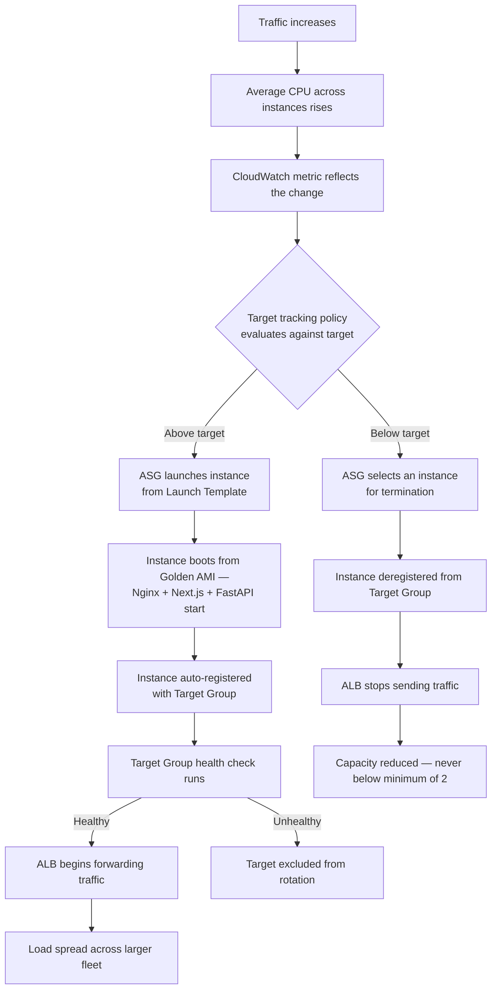

# Scalability & High Availability

## Horizontal scaling

Horizontal scaling is the architecture's primary and fully automated scaling mechanism. The Auto Scaling Group (`dental-asg`) adjusts instance count between **2 and 6** using a **Target Tracking policy on CPU utilisation**, and the ALB distributes requests across whatever healthy instances currently exist.

Three implementation choices make this actually work — none are defaults:

- **Statelessness.** EC2 instances hold no persistent application data, so any instance can serve any request — adding one adds usable capacity immediately.
- **The Golden AMI.** A new instance is functionally identical to existing ones with no configuration-management step at boot, keeping launch time close to pure boot time (validated by the reboot test performed before the AMI was captured).
- **Automatic registration.** The ASG–Target Group binding means new capacity enters service without operator action.

### Vertical scaling

Available but manual. Instances are `t3.small`; moving to a larger type requires a new Launch Template version and replacing running instances (e.g., via an instance refresh) — the instance type cannot change on a running instance in place. RDS instance class can likewise be changed, though the current class is not documented.

### Capacity limits

The ceiling of 6 instances is three times the baseline of 2. **What that translates to in concurrent users or requests/second is not stated anywhere in the source material** — no load testing was performed, and providing a number here would be fabrication. What can be said structurally: at 6 instances the compute tier stops scaling automatically, and further growth requires raising the maximum, moving to a larger instance type, or reducing per-request cost.

### The real scalability constraint: the database does not scale horizontally

RDS is a single writable primary; the Multi-AZ standby takes no read traffic. Every one of the 2–6 application instances directs its queries at the same database instance — the compute tier can triple, the database cannot. This is why the `DatabaseConnections > 80` alarm is well-placed: connection pressure from pool multiplication across scaled-out instances is typically the first symptom to appear. There is no ElastiCache layer, no RDS Proxy for connection pooling, and CloudFront caching does not relieve dynamic/API load — it only helps static assets.

## High availability

### Redundancy by layer

| Layer | Redundancy | Single point of failure? |
|---|---|---|
| Edge | CloudFront — globally distributed AWS-managed service | No |
| Load balancing | ALB deployed across two AZs | No |
| Compute | ASG, minimum 2 instances, two AZs, automatic replacement | No |
| Outbound connectivity | One NAT Gateway per AZ, zone-local routing | No |
| Database | Multi-AZ primary/standby as documented (verification status noted below) | Depends on Multi-AZ actually being enabled |
| DNS | AWS-generated endpoint — Route 53 not implemented | Managed by AWS |

### Failure scenario: single EC2 instance

1. The instance stops responding on the Target Group's health-check path.
2. After the configured number of consecutive failures, the ALB marks the target **unhealthy** and stops routing new requests to it. **User impact ends here** for new requests.
3. `HealthyHostCount` falls to 1; the CloudWatch alarm enters ALARM within 5 minutes and SNS sends an email.
4. Depending on the ASG health-check type (`EC2` or `ELB` — **not documented**), the ASG may terminate the instance. If it does, `GroupInServiceInstances` also fires.
5. The ASG launches a replacement from the Launch Template.
6. The replacement boots from the Golden AMI (verified by the reboot test), receives `LuminaEC2SSMRole`, and is auto-registered with the Target Group.
7. Once healthy, the ALB routes to it and the alarms clear.

**Operationally significant unknown:** if the ASG health-check type is `EC2` rather than `ELB`, an instance whose Nginx has died but whose OS is otherwise healthy is removed from ALB rotation but **not replaced** by the ASG, since it still passes EC2-level status checks. Confirming this setting is listed as an operational check in [`docs/troubleshooting.md`](troubleshooting.md).

### Failure scenario: Availability Zone failure

- **ALB** — nodes in the surviving AZ continue accepting traffic.
- **Compute** — instances in the failed AZ become unhealthy and leave rotation; the ASG can launch replacements in the surviving AZ's subnet.
- **Outbound connectivity** — the surviving AZ's own NAT Gateway is unaffected; this is precisely the dependency the two-NAT-Gateway design was built to eliminate.
- **Database** — if Multi-AZ is enabled, RDS fails over to the standby in the surviving AZ.

**Honest qualification:** during an AZ failure, fleet capacity is temporarily halved and all traffic concentrates on the surviving AZ's instances. Whether the application remains *performant*, as opposed to merely *available*, depends on whether the surviving capacity (plus any scale-out) can absorb full load — which is not measured anywhere in the source material.

### Failure scenario: database failure

If Multi-AZ is enabled, RDS detects the primary's failure, promotes the standby, and repoints the endpoint's DNS record. Because the application connects to the RDS **endpoint**, not an instance address, it reconnects automatically. Two realities are stated plainly rather than glossed over:

1. Failover is **not instantaneous** — typically tens of seconds during which database connections fail. The application will surface errors during that window unless it implements retry logic, which is not documented.
2. **If Multi-AZ is not actually enabled** on the deployed instance, database failure is a full outage recoverable only from backups — and backup configuration (retention period, automated backups, restore testing) is undocumented.

### What the architecture does not protect against

- **Regional failure.** Single-region deployment; no cross-region replica or documented disaster-recovery plan.
- **Data corruption or accidental deletion.** Multi-AZ replicates faithfully — including a destructive statement. Only backups address this, and their configuration is undocumented.
- **Application-level defects.** A bug baked into the AMI is deployed to every instance the ASG launches. Health checks detect a process that is down, not one that returns wrong answers.
- **Sustained load beyond 6 instances.** The maximum capacity is a hard ceiling.

## Performance mechanisms (implemented, unmeasured)

| Mechanism | Effect |
|---|---|
| CloudFront edge caching | Reduces latency for static assets; removes that traffic from the ALB/EC2 tier entirely |
| ALB request distribution | Prevents any one instance from queueing while others idle |
| Target-tracking scaling | Addresses CPU-saturation latency; does not relieve database-tier latency |
| Nginx reverse proxy, single origin | Avoids cross-origin overhead on API calls; both frontend and API served from one port |
| Loopback backend communication | Nginx→FastAPI traffic never touches the network stack |
| VPC-local database traffic | EC2 and RDS traffic never traverses a NAT Gateway or the internet |

No latency, throughput, or cache-hit-ratio measurements exist in the source documentation, so no quantitative performance claim is made anywhere in this repository.

## Recommendations

1. **Confirm and document** RDS Multi-AZ status, backup retention, and automated backups; perform an actual restore test.
2. **Review the ASG health-check type** and set it to `ELB` so application-level failures (not just EC2-level failures) trigger replacement.
3. **Point the Target Group health check at a path that exercises the full dependency chain** (API + database), so a "healthy" target actually means a target that can serve real requests end to end.
4. **Add RDS Proxy** to pool and multiplex connections — directly addressing the pressure the `DatabaseConnections > 80` alarm exists to detect.
5. **Add ElastiCache** for frequently read, infrequently changed data, and/or **RDS read replicas** if the read/write ratio justifies it.
6. **Run load testing** to establish real capacity figures before treating the maximum of 6 as validated.
7. **Define a disaster-recovery position** — even an explicit, documented acceptance of single-region risk with a stated RTO/RPO is better than leaving it undefined.
