# Lumina Dental — AWS Architecture Report

**Scalable, Highly Available Web Application on EC2 with ALB, Auto Scaling, RDS PostgreSQL, CloudFront and AWS WAF**

| | |
|---|---|
| **Project** | Lumina Dental |
| **Architecture type** | EC2-based, multi-AZ, highly available web application |
| **Application stack** | Next.js (frontend) · FastAPI/Uvicorn (backend) · Nginx (reverse proxy) · Amazon RDS PostgreSQL |
| **Document scope** | Architecture, implementation, security, operations, and assessment |
| **Sources of truth** | `project-doc.md` (primary) and the uploaded architecture diagram (supporting evidence) |

> **Note on evidence.** Every statement in this report is derived from the supplied project documentation and the uploaded architecture diagram. Where a detail is not present in either source, this document says so explicitly rather than inferring a value. Where the documentation and the diagram disagree, the discrepancy is recorded in **Section 27** and in the relevant section, not silently resolved.

---

## 1. Executive Summary

Lumina Dental is a web application composed of a Next.js frontend and a FastAPI backend, deployed on AWS as a horizontally scalable, multi-Availability-Zone architecture. The deployment replaces the single-server model — in which one EC2 instance holds the application, the web server, and the database — with a layered design that separates the public entry point, the stateless compute tier, and the managed stateful database tier.

The implemented architecture places an internet-facing Application Load Balancer in front of an Auto Scaling Group of EC2 instances running in private subnets, with an Amazon RDS PostgreSQL database in dedicated private database subnets that carry no route to the internet. Amazon CloudFront sits in front of the load balancer as the edge delivery layer, and AWS WAF provides Layer 7 request inspection using AWS managed rule groups together with project-specific IP, geographic, rate-based and body-size rules. Administrative access to the compute tier is delivered through AWS Systems Manager Session Manager rather than SSH, and CloudWatch alarms across the Auto Scaling Group, the load balancer, the target group and the database publish to an Amazon SNS topic that delivers email notifications.

The architectural goals the implementation actually addresses are:

- **High availability at the compute layer** — the Auto Scaling Group maintains a minimum of two EC2 instances distributed across two Availability Zones, and the Application Load Balancer removes unhealthy targets from rotation based on Target Group health checks.
- **Horizontal scalability** — a Target Tracking scaling policy on CPU utilisation adjusts capacity between a minimum of 2 and a maximum of 6 instances without manual intervention.
- **Network isolation and defence in depth** — a three-tier subnet model (public / private application / private database) combined with a chained Security Group model in which each tier accepts traffic only from the tier above it.
- **Application-layer security** — an AWS WAF Web ACL with managed Common, SQL injection, Admin Protection and Anti-DDoS rule groups, validated through WAF sampled requests.
- **Operational accessibility without inbound exposure** — Systems Manager Session Manager provides shell access to private instances with no SSH port, no public IP, and no bastion host.
- **Observability** — seven CloudWatch alarms across four AWS services, all routed to a single SNS email endpoint.

Two aspects of the intended production design were **deliberately not deployed** and are documented as such throughout this report: **Amazon Route 53** (no domain was purchased) and, consequently, **HTTPS via AWS Certificate Manager**. The application is currently served over HTTP through the AWS-generated endpoint. These are treated in **Section 11** and **Section 26** as planned architecture, not as delivered infrastructure.

The result is a coherent, well-separated architecture that demonstrates the standard AWS pattern for a stateless web tier over a managed database. Its principal remaining gaps are transport encryption, secrets management, centralised logging, and an automated deployment path — all addressed honestly in **Sections 25 and 26**.

---

## 2. Project Overview

### 2.1 Objective

The objective of the project is to take an application that runs as a conventional single-server web stack and deploy it on AWS in a form that survives the loss of an individual server, distributes load across multiple servers, keeps the database off the application servers, and restricts the public attack surface to a single controlled entry point.

The documentation frames this explicitly as building a *scalable web application with ALB and Auto Scaling*, with the Golden AMI as the mechanism that makes every application server identical and disposable.

### 2.2 Application composition

The application consists of three processes running together on each EC2 instance, plus one external managed service:

| Component | Technology | Bind address | Exposure |
|---|---|---|---|
| Reverse proxy / HTTP entry point | Nginx | `0.0.0.0:80` | Reachable from the ALB Security Group only |
| Frontend | Next.js (production build) | `*:3000` | Internal — reached only through Nginx |
| Backend / API | FastAPI via Uvicorn | `127.0.0.1:8000` | Loopback only — not reachable off-host |
| Database | Amazon RDS PostgreSQL | RDS endpoint, TCP `5432` | Private subnets, reachable from the application Security Group only |

The FastAPI binding is architecturally significant. Because Uvicorn is bound to `127.0.0.1` rather than `0.0.0.0`, the API process is unreachable from outside the instance at the operating-system level, independent of any Security Group configuration. This is a host-level control that reinforces the network-level controls rather than duplicating them.

### 2.3 AWS deployment model

The deployment model is **AMI-based immutable compute over a managed database**. A single EC2 instance was configured and validated by hand, an AMI was captured from it, and that AMI became the source image for a Launch Template consumed by an Auto Scaling Group. The database was moved out of the instance entirely into Amazon RDS, so that the AMI carries no state.

The documentation states this principle directly: the AMI is the *application* image, not the *database* image. EC2 instances are stateless application servers running Next.js, FastAPI and Nginx; RDS is the stateful layer. When Auto Scaling launches a replacement instance, that instance does not create a new database — it connects to the existing RDS endpoint. This separation is what makes horizontal scaling possible at all.

### 2.4 Deployed AWS services

The documentation's own statement of current project state lists the following as implemented: VPC, public and private subnets, route tables, NAT Gateway, Security Groups, EC2, Launch Template, Auto Scaling Group, Application Load Balancer, Target Group, AWS WAF, CloudFront, RDS, Systems Manager, CloudWatch, and SNS.

Route 53 is listed in the target architecture but is explicitly recorded as **not implemented**.

### 2.5 Expected system behaviour

Under normal operation the system is expected to maintain two healthy application instances spread across two Availability Zones, serve all user traffic through the load balancer, cache eligible static assets at CloudFront edge locations, inspect inbound requests at the WAF layer, hold all persistent data in RDS PostgreSQL, and notify an operator by email whenever any of the seven configured alarm conditions is met. Under increased CPU load the Auto Scaling Group is expected to add instances up to a ceiling of six; when load subsides it is expected to return toward two.

---

## 3. Architecture Overview

The architecture is best read as five concentric layers, from the global edge inward to the isolated database tier.

### 3.1 Edge layer

**Amazon CloudFront** is the outermost documented component in the request path. It is configured with the Application Load Balancer as its origin. CloudFront does not connect to EC2 instances directly; every cache miss is forwarded to the ALB, which then applies its own routing and health logic. Its role is edge delivery and caching of static content, described in detail in Section 10.

**AWS WAF** performs Layer 7 inspection of inbound requests before they reach the application infrastructure. The Web ACL is named `dental-waf` (inferred from the project rule naming, e.g. `dental-waf_IPV4_Allow`) and combines four AWS managed rule groups with five project-defined rules. Section 9 covers the full rule inventory.

**Amazon Route 53** appears in the architecture diagram as the DNS entry point, but the documentation states unambiguously that it was **not deployed**, because no domain was purchased. It is documented in Section 11 as planned architecture.

### 3.2 Regional network boundary

All regional infrastructure resides inside a single dedicated VPC:

- **VPC:** `aws-project-vpc`, CIDR `10.0.0.0/16`
- **Availability Zones:** two
- **Subnets:** six — one public, one private application, and one private database subnet per Availability Zone
- **Internet Gateway:** `aws-project-igw`, attached to the VPC
- **NAT Gateways:** `nat-gateway-az1` and `nat-gateway-az2`, one per public subnet, each with a dedicated Elastic IP
- **Route tables:** five — `public-rt`, `private-app-rt-az1`, `private-app-rt-az2`, `private-db-rt-az1`, `private-db-rt-az2`

The AWS Region is **not explicitly stated** in the documentation. An example ALB DNS name in the Route 53 section uses `eu-north-1`, which suggests the Stockholm region, but this appears in an illustrative example rather than as a recorded configuration value, so it is not asserted as fact in this report.

### 3.3 Load-balancing layer

An internet-facing **Application Load Balancer** operating at Layer 7 is the single public entry point for application traffic. It is deployed across the selected Availability Zones and forwards traffic to a **Target Group** of type *instance* over HTTP on port 80. An **HTTP listener** is configured; no HTTPS listener exists in the current implementation because no ACM certificate could be issued without a domain.

### 3.4 Compute layer

EC2 instances of type **t3.small** run in the private application subnets under the control of an **Auto Scaling Group** (referred to in the CloudWatch configuration as `dental-asg`) with minimum 2, desired 2, and maximum 6 instances. Instances are created from a **Launch Template** that specifies the custom application AMI, the instance type, the application Security Group, and the IAM instance profile carrying the `LuminaEC2SSMRole` role.

### 3.5 Data layer

**Amazon RDS for PostgreSQL** is placed in the private database subnets. The application connects to the RDS service endpoint on TCP 5432 rather than to a specific database instance address, which is what allows a failover to occur transparently to the application. The database has no route to the internet in either direction.

### 3.6 Management and observability plane

Four services operate outside the user request path:

- **AWS Systems Manager (Session Manager)** for administrative shell access to instances.
- **Amazon CloudWatch** for metric collection across the ASG, ALB, Target Group and RDS.
- **CloudWatch Alarms** evaluating seven configured conditions.
- **Amazon SNS** delivering alarm notifications to an email endpoint.

The architecture diagram correctly draws these four with dashed connectors labelled *Monitoring / Management*, visually distinguishing them from the solid *User / Application Traffic* path. That distinction is architecturally meaningful and is expanded in Section 14.

---

## 4. Detailed Network Architecture

### 4.1 Addressing and subnet structure

The VPC uses `10.0.0.0/16`, subdivided into six `/24` subnets with a deliberate numbering convention: `10.0.1.x` and `10.0.2.x` for public subnets, `10.0.1x.x` for private application subnets, and `10.0.2x.x` for private database subnets.

| Subnet | AZ | CIDR | Tier | Purpose |
|---|---|---|---|---|
| `Public-Subnet-AZ1` | AZ-1 | `10.0.1.0/24` | Public | NAT Gateway; ALB node |
| `Private-App-Subnet-AZ1` | AZ-1 | `10.0.11.0/24` | Private | EC2 / Auto Scaling Group |
| `Private-DB-Subnet-AZ1` | AZ-1 | `10.0.21.0/24` | Private isolated | Amazon RDS |
| `Public-Subnet-AZ2` | AZ-2 | `10.0.2.0/24` | Public | NAT Gateway; ALB node |
| `Private-App-Subnet-AZ2` | AZ-2 | `10.0.12.0/24` | Private | EC2 / Auto Scaling Group |
| `Private-DB-Subnet-AZ2` | AZ-2 | `10.0.22.0/24` | Private isolated | Amazon RDS |

The three-tier structure is not decorative. Each tier is defined by what its route table permits, which is what makes "public" and "private" concrete rather than nominal.

### 4.2 Route tables — the actual definition of each tier

A subnet is public only because its route table contains a default route to an Internet Gateway. The project's five route tables encode three distinct connectivity postures:

| Route table | Associated subnets | Routes | Resulting posture |
|---|---|---|---|
| `public-rt` | Both public subnets | `10.0.0.0/16 → local`, `0.0.0.0/0 → IGW` | Bidirectional internet reachability |
| `private-app-rt-az1` | `Private-App-Subnet-AZ1` | `10.0.0.0/16 → local`, `0.0.0.0/0 → NAT GW AZ-1` | Outbound-only internet access |
| `private-app-rt-az2` | `Private-App-Subnet-AZ2` | `10.0.0.0/16 → local`, `0.0.0.0/0 → NAT GW AZ-2` | Outbound-only internet access |
| `private-db-rt-az1` | `Private-DB-Subnet-AZ1` | `10.0.0.0/16 → local` only | No internet path in either direction |
| `private-db-rt-az2` | `Private-DB-Subnet-AZ2` | `10.0.0.0/16 → local` only | No internet path in either direction |

The database route tables intentionally omit both `0.0.0.0/0 → NAT Gateway` and `0.0.0.0/0 → Internet Gateway`. This is the strongest isolation control in the architecture: even if the RDS Security Group were later misconfigured to permit `0.0.0.0/0` on port 5432, there is no route by which internet traffic could arrive at, or leave, the database subnets. Routing and Security Groups here are genuinely independent layers rather than two expressions of the same control.

### 4.3 NAT Gateway design and the per-AZ decision

Two NAT Gateways were deployed, one in each public subnet, each with its own Elastic IP. Crucially, the private application route table in AZ-1 points at the NAT Gateway in AZ-1, and the AZ-2 route table points at the AZ-2 gateway.

This is a specific availability decision. A single NAT Gateway serving both Availability Zones would be cheaper, but it would create a cross-AZ dependency: instances in the healthy zone would lose outbound internet connectivity if the zone hosting the NAT Gateway failed. Since outbound connectivity is what Systems Manager, package retrieval, and any external API calls depend on, that dependency would partially defeat the purpose of a multi-AZ deployment. The project accepted the cost of a second NAT Gateway to eliminate it.

NAT Gateways provide **outbound-initiated** connectivity only. They do not permit unsolicited inbound connections to private instances. Because a NAT Gateway is an AWS-managed service rather than an EC2 instance, it has no Security Group of its own; its behaviour is governed by route tables, Network ACLs, and the Security Groups of the resources that use it.

### 4.4 Traffic paths

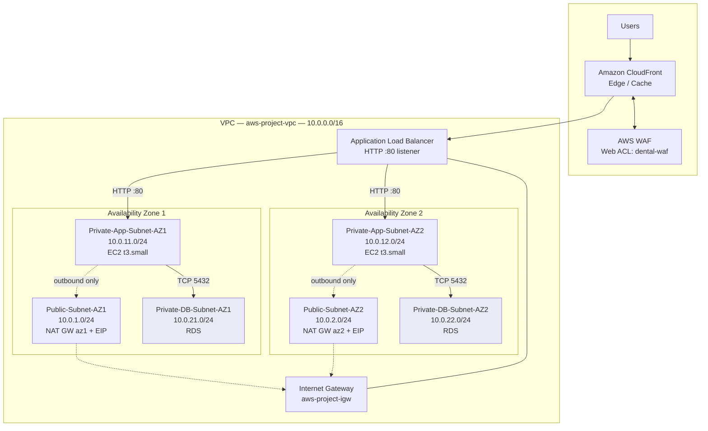

Three distinct flows exist, and they must not be conflated:

**Inbound application traffic** enters through CloudFront, is inspected by WAF, reaches the Application Load Balancer in the public subnets, and is forwarded to Nginx on port 80 on a healthy private instance. No inbound path terminates on an EC2 instance directly.

**Outbound instance-initiated traffic** — Systems Manager agent communication, package updates, any external call the application makes — leaves the private application subnet via its zone-local NAT Gateway, then the Internet Gateway. This path cannot be reversed by an external party.

**Database traffic** never leaves the VPC. It travels over the VPC's local route from a private application subnet to a private database subnet on TCP 5432.

### 4.5 Why the database sits in its own subnet tier

Placing RDS in dedicated database subnets rather than sharing the application subnets serves two purposes. First, it allows the route-level isolation described above to apply to the database without also stripping the application instances of the outbound access they require. Second, it creates a clean boundary for the RDS DB Subnet Group, which requires subnets in at least two Availability Zones and is the mechanism by which a Multi-AZ standby is placed in a different zone from the primary.

---

## 5. Application Architecture

### 5.1 The on-instance stack

Each EC2 instance launched from the Golden AMI runs the complete application stack. Nginx is the only process listening on an externally reachable interface.

Nginx configuration is split conventionally: the main file at `/etc/nginx/nginx.conf` contains `include /etc/nginx/conf.d/*.conf;`, and the application-specific configuration lives at `/etc/nginx/conf.d/lumina.conf`, which is therefore loaded automatically.

### 5.2 Nginx routing

`lumina.conf` defines two location blocks that implement the entire frontend/backend split:

| Location | Directive | Destination | Serves |
|---|---|---|---|
| `/` | `proxy_pass http://127.0.0.1:3000;` | Next.js | All page and static asset requests |
| `/api/` | `proxy_pass http://127.0.0.1:8000/;` | FastAPI via Uvicorn | All API requests |

The architectural benefit is that the frontend and the API are published under a **single origin and a single port**. A client never needs to reach `:3000` or `:8000`; it issues every request to port 80 and Nginx decides internally which upstream should handle it. This keeps both internal ports closed to the network, avoids cross-origin complexity between the frontend and the API, and means the load balancer only ever needs to know about one port per target.

### 5.3 Request path through the instance

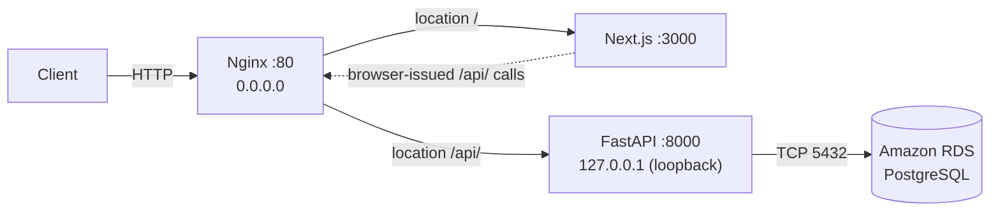

Note the dotted return path: the Next.js frontend does not call FastAPI directly over a private channel. Browser-side calls from the rendered frontend are issued to `/api/` on the same public origin and re-enter through Nginx. This is why the reverse-proxy split matters functionally and not only cosmetically.

### 5.4 Database connectivity and configuration

The backend connects to RDS using a standard connection configuration:

```
DATABASE_HOST=<RDS_ENDPOINT>
DATABASE_PORT=5432
DATABASE_NAME=<DATABASE_NAME>
DATABASE_USER=<DATABASE_USER>
DATABASE_PASSWORD=<DATABASE_PASSWORD>
```

The documentation states that credentials should not be unnecessarily exposed in application source code, and identifies AWS Secrets Manager combined with the EC2 IAM role as the appropriate production mechanism for retrieving them. **Secrets Manager is not part of the current implementation.** In the deployed architecture, database credentials are supplied through the application configuration captured in the AMI. This is recorded as a limitation in Section 25 and as a recommendation in Section 26.

The connection targets the **RDS service endpoint**, not an instance address. This is required for failover transparency: on a Multi-AZ failover the endpoint's DNS record is repointed to the promoted standby, and an application holding the endpoint name reconnects to the new primary without configuration change. An application that had hard-coded an instance address would not.

### 5.5 Ports in the final model

| Port | Process | Scope |
|---|---|---|
| 80 | Nginx | Reachable from the ALB Security Group only |
| 3000 | Next.js | Instance-internal |
| 8000 | FastAPI / Uvicorn | Loopback only |
| 5432 | PostgreSQL (remote) | Outbound from application instances to RDS |
| 22 | SSH | **Not exposed** — no inbound rule; replaced by Session Manager |

The pre-AMI documentation records that during the single-instance build phase the instance did have SSH listening on `0.0.0.0:22` and was reachable by public IP, and it anticipated Security Group rules for ports 80, 443 and a restricted 22. The final deployed architecture supersedes that: instances hold no public IP, `ec2-sg` contains no inbound SSH rule, and administrative access is delivered through Systems Manager. This is an intentional evolution between project phases rather than a contradiction, but it is worth noting when reading the two sections of the source documentation side by side.

### 5.6 Validation performed before image capture

The application stack was verified before the AMI was created. A local backend check returned `{"status":"ok","service":"Lumina Dental API"}` from `http://127.0.0.1:8000`, the frontend was confirmed reachable through the instance's public IP, and frontend-to-backend communication through the Nginx proxy was confirmed end to end down to RDS PostgreSQL.

A **reboot test** was then performed and the required services — Nginx, Next.js, and FastAPI/Uvicorn — returned successfully afterwards. This test is more significant than it may appear: an Auto Scaling Group launches instances unattended, so any process that only starts because an engineer typed a command in a terminal would leave every newly launched instance permanently unhealthy. Verifying service restart behaviour before capturing the image is what makes the AMI safe to use as a scaling source.

---

## 6. Load Balancer Architecture

### 6.1 Purpose

The Application Load Balancer is a Layer 7 load balancer that serves as the single public entry point for application traffic. Operating at Layer 7 means it terminates the HTTP connection, parses the request, and makes forwarding decisions with knowledge of the HTTP protocol — as opposed to a Layer 4 balancer which forwards TCP segments without inspecting them. This is what allows HTTP health checks against an application path, and what would later allow path-based routing rules or HTTPS termination at the load balancer.

Architecturally, the ALB does three things that individual EC2 instances cannot do for themselves: it gives the application a stable public identity independent of any instance's lifetime, it removes failed instances from service without human intervention, and it acts as the security boundary behind which the compute tier can be kept entirely private.

### 6.2 Listener configuration

An **HTTP listener** is configured on the ALB. It receives inbound requests on the HTTP port and forwards them to the application Target Group.

**HTTPS is not configured in the current implementation.** The documentation states that TLS would be added by issuing an ACM certificate for the application's domain and adding an HTTPS listener on port 443 that terminates TLS at the ALB before forwarding to the Target Group. Because no domain was purchased, no publicly trusted certificate could be issued, and this listener does not exist. The ALB is therefore responsible for HTTP traffic distribution only.

The documented — but not deployed — final listener configuration would be two listeners: port 80 performing a redirect to HTTPS, and port 443 forwarding to the Target Group with the ACM certificate attached. Attaching the certificate at the ALB rather than to each instance is the correct choice for an Auto Scaling architecture, because instances are created and destroyed continuously while the listener configuration is stable.

### 6.3 Target Group configuration

| Setting | Value |
|---|---|
| Target type | Instance |
| Protocol | HTTP |
| Port | 80 |
| Health checks | Enabled |
| Health check protocol | HTTP |
| Health check path | *Documented only as "the application's available HTTP endpoint/path" — the specific path is not recorded* |

The Target Group is the object that holds the set of instances eligible to receive traffic, and it is where health state is evaluated. It is attached to the Auto Scaling Group, which means registration and deregistration are automatic: when the ASG launches an instance it is registered; when the ASG terminates an instance it is deregistered. No manual target management occurs, and the Target Group therefore always reflects the current membership of the ASG.

**Not documented:** the health check interval, timeout, healthy threshold, unhealthy threshold, success matcher, and deregistration delay. These are left at whatever values were configured; the documentation does not record them.

### 6.4 Health-check behaviour and failure handling

The ALB periodically issues HTTP requests to the configured health-check path on each registered target. A target that responds according to the configured criteria is marked healthy and remains in rotation. A target that fails is marked unhealthy, and the ALB stops forwarding new requests to it while continuing to serve from the remaining healthy targets.

This provides fault isolation at the load-balancing layer *before* any replacement occurs. The distinction matters operationally: the ALB's response to failure is immediate and traffic-level, whereas the Auto Scaling Group's response is slower and capacity-level. Users stop being routed to a broken instance within a few health-check cycles; the replacement instance arrives afterwards.

**An architectural observation, offered as analysis rather than as documented configuration:** because the health check runs HTTP against port 80, a passing check confirms that Nginx is running and that its upstream for the checked path responds. If the health-check path resolves through the `/` location, the check exercises Nginx and Next.js but does not exercise FastAPI or the RDS connection. An instance whose database connectivity had failed could therefore still report healthy. Since the documentation does not record which path is configured, this cannot be confirmed either way — it is raised in Section 26 as a recommendation to point the health check at a path that traverses the full dependency chain.

### 6.5 Relationship between the ALB and the Auto Scaling Group

The two components are deliberately decoupled and communicate only through the Target Group:

- The **ALB** decides where each request goes, based on current health state.
- The **Target Group** holds membership and evaluates health.
- The **ASG** decides how many instances should exist and creates or destroys them.

Neither the ALB nor the ASG addresses the other directly. This indirection is what allows the number of instances to change continuously without any load balancer reconfiguration.

---

## 7. Auto Scaling Architecture

### 7.1 Launch Template

The Launch Template is the single source of truth for how every application instance is constructed. Its documented configuration:

| Setting | Value |
|---|---|
| AMI | Custom application AMI (the validated Golden Image) |
| Instance type | `t3.small` |
| Key pair | The configured EC2 key pair, where applicable |
| Security Group | The application Security Group (`ec2-sg`) |
| IAM instance profile | Profile carrying `LuminaEC2SSMRole` |
| Network placement | Subnets selected by the Auto Scaling Group |
| Storage | AMI-based root EBS configuration |
| Application configuration | As captured in the AMI |

**User Data is not documented as being used.** The documentation lists it as an optional item ("User Data if required") in the planning sequence but does not record any User Data script as configured. This is architecturally consistent: because the application environment is baked into the AMI and verified to survive reboot, there is no bootstrap work left for User Data to perform. The report does not assume any User Data exists.

The value of the Launch Template is configuration consistency. Every instance the ASG launches receives the same image, the same instance type, the same Security Group and the same IAM permissions. Horizontal scaling is only meaningful if instance *n+1* is functionally identical to instance *n*; the Launch Template is what guarantees that.

### 7.2 Auto Scaling Group configuration

| Setting | Value |
|---|---|
| Launch Template | The custom application Launch Template |
| Minimum capacity | **2** |
| Desired capacity | **2** |
| Maximum capacity | **6** |
| Availability Zones | Multiple (the two configured AZs) |
| Target Group | The application Target Group |
| Scaling policy | Target Tracking on CPU utilisation |

The three capacity values carry distinct meanings. **Minimum 2** is a floor that scale-in can never breach, which is what makes the architecture tolerant of a single instance failure by default — there is never a moment of normal operation with only one server. **Desired 2** is the steady-state count the group actively maintains. **Maximum 6** is the ceiling on automatic scale-out, bounding both capacity and cost.

### 7.3 Self-healing behaviour

The ASG continuously maintains the desired number of healthy instances. If an instance fails or becomes unhealthy and is terminated, the group launches a replacement from the Launch Template to return to desired capacity. This is the self-healing property of the compute layer, and it operates independently of whether a human is watching.

### 7.4 Multi-AZ placement

The ASG is associated with subnets in both Availability Zones, so instances are distributed across two physically separate AWS facilities. If a zone becomes unavailable, the ASG can maintain or recreate capacity in the remaining zone while the ALB continues directing traffic only to healthy targets.

### 7.5 Scaling policy

A **Target Tracking** scaling policy is configured, using **CPU utilisation** as the scaling metric. Target tracking works by having the ASG maintain a metric near a specified target value, adding capacity when the observed average rises above it and removing capacity when it falls below — the group manages the underlying alarms itself rather than requiring explicitly defined step thresholds.

**The specific target CPU value is not recorded in the documentation**, and is therefore not stated in this report.

### 7.6 Scaling lifecycle

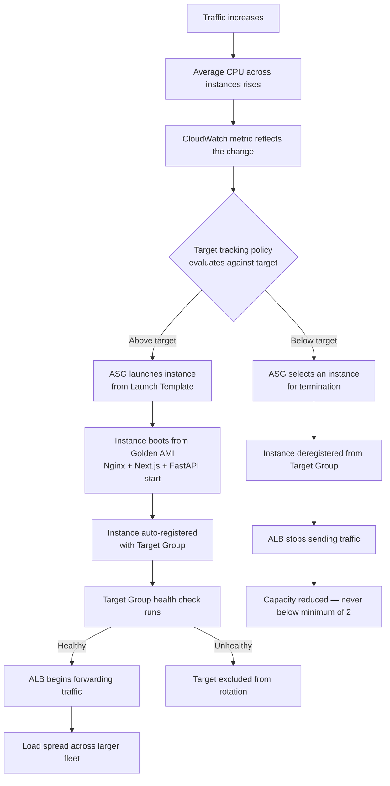

The scale-in path is the mirror image of scale-out: the ASG applies its termination logic to select an instance, removes it from service, deregisters it from the Target Group so the ALB stops sending it traffic, and the remaining instances continue serving — subject always to the minimum of 2.

---

## 8. Amazon RDS Architecture

### 8.1 Engine and placement

The database is **Amazon RDS for PostgreSQL**, listening on the standard PostgreSQL port **TCP 5432**, deployed into the private database subnets (`Private-DB-Subnet-AZ1` and `Private-DB-Subnet-AZ2`) whose route tables carry no default route.

**Not documented:** the DB instance identifier, instance class, allocated storage, storage type, engine version, parameter group, backup retention period, maintenance window, or encryption-at-rest setting. This report makes no claims about any of them.

### 8.2 Primary and standby architecture

The documented database architecture is a single active primary with a synchronised standby. The application does not connect to two endpoints; it connects to the **RDS service endpoint**, and RDS resolves that endpoint to the current primary.

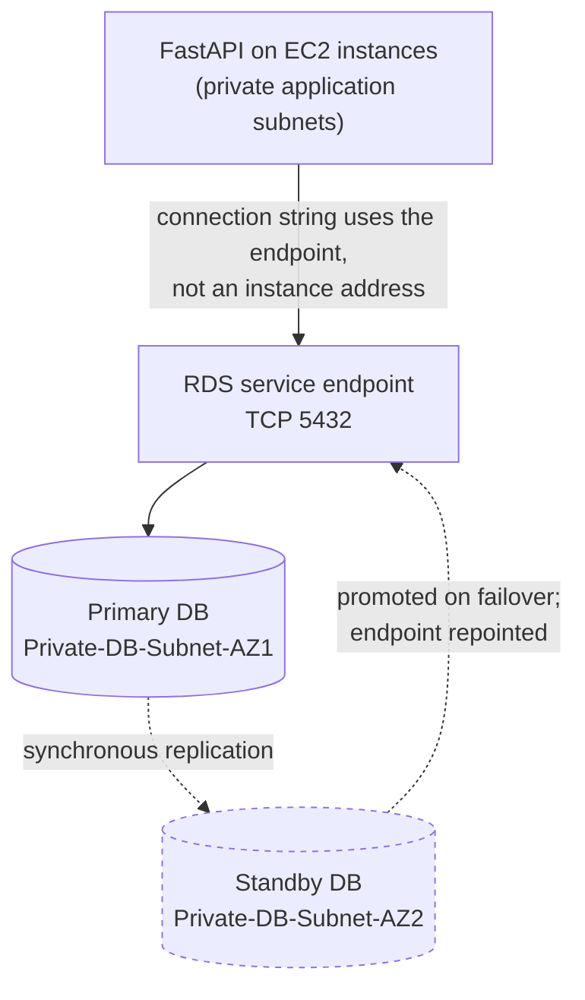

The standby is not used by the application under normal operation — it is not a read replica and carries no read traffic. Its sole function is to hold a synchronised copy so that promotion is possible. If the primary becomes unavailable, RDS performs failover and the application continues addressing the same endpoint.

**A necessary qualification on evidence.** The documentation describes the Multi-AZ primary/standby model consistently as the project's database architecture, the architecture diagram shows RDS spanning both DB subnet groups labelled *Multi-AZ*, and the Route 53 section refers to "RDS Multi-AZ" in the traffic path. However, the documentation contains **no explicit verification step confirming that the Multi-AZ setting was enabled on the deployed instance** — there is no recorded console configuration value or failover test, unlike the explicit verification performed for SSM and WAF. This report therefore treats Multi-AZ as the documented and diagrammed architecture while flagging that its enablement is asserted rather than evidenced. Confirming it is a one-field check on the DB instance and is listed in Section 22.

### 8.3 Connectivity and Security Group model

The RDS Security Group `rds-sg` permits:

| Direction | Protocol | Port | Source / Destination |
|---|---|---|---|
| Inbound | TCP | 5432 | **`ec2-sg`** (Security Group reference) |
| Outbound | All | All | `0.0.0.0/0` |

The rule `TCP 5432 from 0.0.0.0/0` is explicitly **not** configured. The inbound source is a Security Group reference rather than a CIDR block, which is the significant design choice here: it means authorisation follows *membership of the application Security Group*, not a network address. Every instance the ASG launches is automatically authorised because the Launch Template assigns it `ec2-sg`, and no instance outside that group is authorised regardless of its IP. In a fleet whose IP addresses change continuously, a CIDR-based rule would have to be either dangerously broad or constantly maintained.

### 8.4 Application access versus direct public access

The distinction the documentation draws is worth stating precisely. **Direct public access** would mean a client on the internet opening a TCP connection to port 5432 on the database. That is impossible here for two independent reasons: `rds-sg` admits only `ec2-sg`, and the database subnets have no route to or from the internet. **Application-level access** means a user's HTTP request reaches the application tier, and the application — running inside the VPC with `ec2-sg` attached — opens the database connection on the user's behalf, subject to whatever the application's own authentication and authorisation logic permits.

The database is reached, in other words, only as a side effect of an authorised application operation:

```
Internet → ALB (alb-sg) → EC2 (ec2-sg) → TCP 5432 → RDS (rds-sg)
```

Every arrow in that chain is a separate authorisation decision, and the first three occur before any SQL is issued.

### 8.5 Backup and recovery

**Not documented.** The project documentation does not record backup retention settings, automated backup configuration, snapshot schedules, point-in-time recovery configuration, or any restore testing. Multi-AZ provides availability against infrastructure failure; it does not protect against data corruption or accidental deletion, which is what backups address. This gap is recorded in Section 25.

---

## 9. Security Architecture

### 9.1 The defence-in-depth model

The architecture layers independent controls so that no single misconfiguration exposes the application. The documented layers, from outside in:

| Layer | Control | What it stops |
|---|---|---|
| 1 | CloudFront | Provides a controlled edge entry point |
| 2 | AWS WAF | Layer 7 inspection — common exploits, SQLi, admin path scanning, abusive rates |
| 3 | Application Load Balancer | Single public entry point; instances never addressed directly |
| 4 | Security Groups (`alb-sg` → `ec2-sg` → `rds-sg`) | Tier-to-tier network authorisation |
| 5 | Subnet and route-table isolation | No internet route to compute or database tiers |
| 6 | Application authentication | Identity verification |
| 7 | Application authorisation | Role verification (e.g. admin role) |
| 8 | MFA | Additional factor for administrative accounts, where supported |

Layers 6, 7 and 8 are application-level and are described in the documentation as the required primary protection for administrative functionality; the documentation does not record their implementation state, so this report does not assert it.

### 9.2 Security Group chain

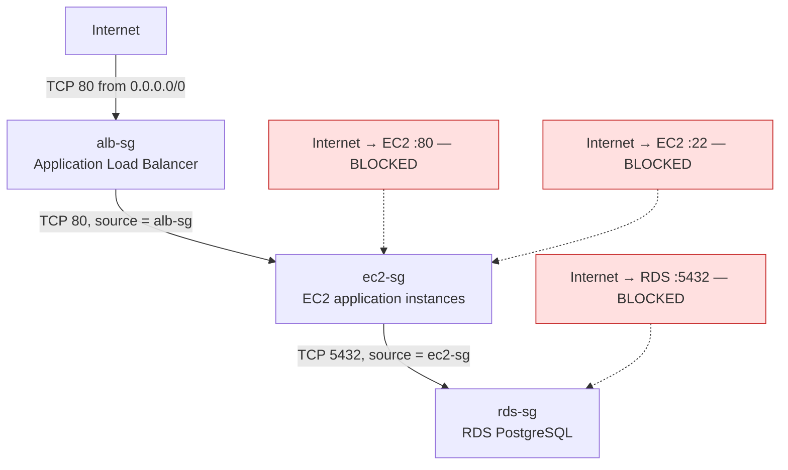

| Security Group | Inbound | Outbound |
|---|---|---|
| `alb-sg` | TCP 80 from `0.0.0.0/0` (TCP 443 planned when TLS is configured) | All traffic to `0.0.0.0/0` |
| `ec2-sg` | TCP 80 from `alb-sg` only. **No** `TCP 80 from 0.0.0.0/0`. **No** `TCP 22 from 0.0.0.0/0`. | All traffic to `0.0.0.0/0` |
| `rds-sg` | TCP 5432 from `ec2-sg` only. **No** `TCP 5432 from 0.0.0.0/0`. | All traffic to `0.0.0.0/0` |

The documented traffic matrix:

| Path | Status |
|---|---|
| Internet → ALB :80 | ALLOWED |
| Internet → ALB :443 | Allowed later (when TLS is configured) |
| ALB → EC2 :80 | ALLOWED |
| Internet → EC2 (any port) | BLOCKED |
| Internet → EC2 :22 | BLOCKED |
| EC2 → RDS :5432 | ALLOWED |
| Internet → RDS :5432 | BLOCKED |
| EC2 → Internet | ALLOWED via NAT Gateway |
| EC2 AZ-1 → NAT AZ-1 | ALLOWED |
| EC2 AZ-2 → NAT AZ-2 | ALLOWED |
| RDS → Internet | NOT ROUTED |
| ALB → RDS | BLOCKED / not required |

Outbound rules on all three groups permit all traffic. This is the AWS default and is what allows the instances to reach Systems Manager, package repositories and RDS. It is worth noting as a deliberate posture rather than an oversight: egress filtering is not implemented, and Section 26 raises VPC endpoints as the standard way to tighten it.

### 9.3 Network ACLs

The architecture diagram's security legend states *"NACLs for Subnet Level Control"*, and NACLs appear in the documentation's list of target-architecture components and in the discussion of how NAT Gateway traffic is governed. However, **no Network ACL rules are documented anywhere in the project documentation** — no NACL names, no allow or deny entries, no subnet associations. This report therefore cannot state what NACL configuration exists. If the default VPC NACLs remain in place, they permit all traffic and contribute nothing beyond the Security Group controls; if custom NACLs were configured, their content is unrecorded. This is listed as a discrepancy in Section 27.

### 9.4 AWS WAF — configured rules

The Web ACL combines four AWS managed rule groups with five project-defined rules. Rules are evaluated in configured priority order.

| Rule | Type | Capacity | Mode | Function |
|---|---|---|---|---|
| `AWS-AWSManagedRulesAntiDDoSRuleSet` | AWS managed | 50 WCU | **COUNT** | Layer 7 anti-DDoS protection and visibility into abusive traffic patterns |
| `dental-waf_IPV4_Allow` | Custom IP set | 1 WCU | — | Explicitly allow trusted IPv4 addresses |
| `dental-waf_IPV6_Allow` | Custom IP set | 1 WCU | — | Explicitly allow trusted IPv6 addresses |
| `dental-waf_IPV4_Block` | Custom IP set | 1 WCU | — | Explicitly block unwanted IPv4 addresses |
| `dental-waf_IPV6_Block` | Custom IP set | 1 WCU | — | Explicitly block unwanted IPv6 addresses |
| `GeoRule` | Custom | 1 WCU | — | Restrict traffic by geographic origin of the request |
| `GlobalRateBasedRule` | Custom rate-based | 2 WCU | **COUNT** | Monitor global request rate; identify scanners, flooding, abnormal rates |
| `BodySizeRestrictionRule` | Custom | 1 WCU | **COUNT** | Identify requests with excessive payload size |
| `AWS-AWSManagedRulesCommonRuleSet` | AWS managed | 700 WCU | — | Protection against common web application attacks and malicious request patterns |
| `AWS-AWSManagedRulesSQLiRuleSet` | AWS managed | 200 WCU | — | SQL injection detection |
| `AWS-AWSManagedRulesAdminProtectionRuleSet` | AWS managed | 100 WCU | — | Protects commonly targeted administrative URI paths |

### 9.5 What this configuration does and does not mitigate

Stating this precisely matters, because three of the eleven rules are in COUNT mode and therefore observe rather than block.

**Actively mitigated** (rules in blocking configuration):

- **SQL injection** — via `AWSManagedRulesSQLiRuleSet`. This is particularly relevant because the backend communicates with PostgreSQL, and the rule inspects requests before they reach FastAPI.
- **Common web exploits** — via `AWSManagedRulesCommonRuleSet`, the AWS managed group covering broadly applicable Layer 7 attack techniques.
- **Administrative path scanning** — via `AWSManagedRulesAdminProtectionRuleSet`, verified in testing (see 9.6).
- **Specific untrusted IP addresses** — via the IPv4/IPv6 blocklists, to the extent that addresses are populated in them.
- **Geographic origin** — via `GeoRule`, according to the countries configured. The specific country configuration is not recorded in the documentation.

**Observed but not blocked** (COUNT mode):

- **Layer 7 DDoS patterns** — `AntiDDoSRuleSet` counts matches; it does not block them.
- **Excessive request rates** — `GlobalRateBasedRule` counts; it does not block.
- **Oversized request bodies** — `BodySizeRestrictionRule` counts; it does not block.

COUNT mode is a legitimate and deliberate deployment practice: it allows real traffic patterns to be observed before enforcement, avoiding false positives that would block legitimate users. But it must not be presented as protection. **The architecture currently does not block rate-based abuse, volumetric Layer 7 attacks, or oversized payloads** — it records them. Section 26 recommends transitioning these to BLOCK once the count data supports a threshold.

### 9.6 Validation evidence

Two pieces of real evidence are recorded, which is notable — the WAF configuration was tested rather than assumed.

**Admin path blocking.** A request to `/admin` returned **HTTP 403 Forbidden**. Inspection through WAF sampled requests attributed the response to rule group `AWS-AWSManagedRulesAdminProtectionRuleSet`, matched rule `AdminProtection_URIPATH`, action `BLOCK`, URI `/admin`. This confirmed the 403 originated at the WAF and not from the ALB, the EC2 instance, Nginx, or FastAPI — a distinction that is otherwise difficult to establish from the client side alone.

**Live scanner traffic.** An automated internet scanner was observed reaching the public endpoint: source IP `198.235.24.71`, country United States, URI `/`, with a Palo Alto Networks Cortex Xpanse user agent. Action: `ALLOW`, because the URI matched no blocking rule. The documentation draws the correct conclusion — public endpoints are discovered by automated scanners without the owner publishing them, and this is expected for internet-facing infrastructure. It also confirms that WAF is actively inspecting live traffic.

### 9.7 The Admin Protection conflict — an unresolved design issue

The managed Admin Protection rule currently blocks the application's own legitimate admin panel, because `/admin` is exactly the kind of common administrative URI the rule exists to protect.

The documented plan is to create a narrowly scoped exception rather than disabling the rule group. The reasoning recorded is sound and worth preserving: a broad `ALLOW` on `URI = /admin` must not be used on its own, because it would permit any internet client to reach the admin endpoint, and because an unrestricted ALLOW action is terminating in WAF — it would stop subsequent rules from evaluating that request, silently exempting admin traffic from the Common Rule Set and SQLi inspection. The intended rule order is: admin exception, then Common Rule Set, then SQLi, then Admin Protection, then remaining rules.

The planned supporting control is an IP set named `lumina-admin-allowed-ips` containing `/32` entries for authorised administrator devices. The documentation correctly notes that ISP-assigned public addresses are frequently dynamic, so IP allowlisting is an additional layer and not an authentication mechanism; authentication, authorisation and MFA remain the primary controls.

**Current status:** the exception, the IP set, and the priority review are all recorded as **planned, not implemented**. The practical consequence today is that the admin panel is unreachable through the WAF-protected path.

---

## 10. CloudFront Architecture

### 10.1 Distribution and origin

Amazon CloudFront is configured as the content delivery layer in front of the Application Load Balancer. **The ALB is the configured origin.** CloudFront does not connect to EC2 instances directly — a cache miss is forwarded to the ALB, which applies its listener rules and health-based target selection exactly as it would for any other request.

### 10.2 Cache behaviour

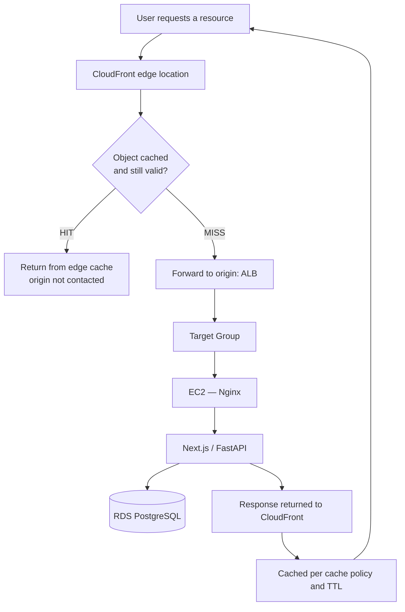

On a **cache hit**, CloudFront returns the object from the edge without contacting the origin. On a **cache miss** — the object is absent or expired — CloudFront forwards the request to the ALB and may cache the response according to the configured cache policy and TTL.

### 10.3 What is and is not cached

The documented caching strategy separates content by type:

**Suitable for caching:** JavaScript files, CSS files, images, fonts, and other static resources.

**Not cached like static assets:** dynamic application and API requests, because their responses may depend on the current user, the session, database state, or request parameters. Serving these from cache would return one user's data to another or present stale application state.

**This is the accurate characterisation: CloudFront in this architecture is used for static asset delivery. Dynamic and API traffic passes through CloudFront to the ALB and is served from the application tier.**

**Not documented:** the specific cache policy, TTL values, cache key configuration, origin request policy, behaviours and their path patterns, compression settings, or any cache invalidation procedure. No values are asserted here.

### 10.4 Performance and architectural effect

Four effects follow from the design as documented. Static resources are served from edge locations geographically closer to the user, reducing latency for those objects. Cached static content does not reach the ALB or the EC2 instances, reducing origin load. That reduction in repeated static traffic means the compute tier's capacity is spent on dynamic work rather than on re-serving identical assets, which improves the effective headroom of the same instance count. And CloudFront integrates in front of the existing WAF and ALB without altering the application-to-RDS path — nothing downstream changed to accommodate it.

The magnitude of these effects depends on the ratio of static to dynamic requests and on cache hit rate, neither of which is measured in the documentation. No quantitative performance claim is made here.

---

## 11. Route 53 and DNS Architecture — **PLANNED, NOT IMPLEMENTED**

> **This section documents architecture that was designed but deliberately not deployed.** Route 53 appears in the uploaded architecture diagram as the DNS entry point. The project documentation states explicitly that it was **not implemented** because no domain was purchased. The diagram should be read as the intended target architecture on this point.

### 11.1 Intended design

Route 53 would have provided a human-readable domain name in place of the AWS-generated ALB endpoint. The planned configuration was a Hosted Zone for the purchased domain containing an **Alias A record** pointing at the Application Load Balancer, with an equivalent record for the `www` name.

An Alias record rather than a CNAME is the correct choice, because a CNAME cannot be created at a zone apex, while a Route 53 Alias record can point a root domain directly at an AWS resource such as an ALB.

Route 53 would have performed **DNS resolution only** — it does not carry HTTP traffic. Its output is the endpoint to which the client then connects directly.

### 11.2 Intended HTTPS chain

The planned production sequence was: purchase a domain; create the Hosted Zone; delegate nameservers if registered elsewhere; create the Alias A record to the ALB; request a public ACM certificate for the domain (and optionally a wildcard); validate it by DNS, which ACM can automate when Route 53 holds the zone; attach the certificate to an ALB HTTPS listener on TCP 443; and reconfigure the port 80 listener to redirect to HTTPS.

The resulting flow would have been:

```
https://<domain> → Route 53 (resolution) → ALB :443 (TLS termination via ACM)
    → WAF → Target Group → EC2 → RDS
```

with `http://<domain>` on port 80 issuing a redirect to the HTTPS listener.

### 11.3 Route 53 health checks

Route 53 supports DNS-level health checks usable with routing policies. The documentation is clear that these were **not required** for this project's failover behaviour: the primary availability mechanism is the combination of ALB, Target Group health checks, Auto Scaling, and multi-AZ EC2 placement. Route 53 health checks would become relevant for multi-region or multi-endpoint failover, which is outside the current scope.

### 11.4 Components planned but not deployed

- Domain purchase
- Route 53 Hosted Zone
- Custom domain DNS records and Alias record to the ALB
- ACM public certificate and its DNS validation
- ALB HTTPS listener on port 443
- HTTP-to-HTTPS redirection

### 11.5 Consequence for the current deployment

The application is accessed through the available AWS-generated endpoint rather than a custom domain, and **client-to-ALB traffic is unencrypted HTTP**. The absence of Route 53 does not affect the functioning of the ALB, Auto Scaling, WAF, CloudFront or RDS layers — DNS is a naming layer, not a data path. The absence of TLS, however, is a genuine security limitation and is recorded as such in Section 25 rather than being minimised here.

---

## 12. Systems Manager Architecture

### 12.1 IAM role

| Property | Value |
|---|---|
| Role name | `LuminaEC2SSMRole` |
| Trusted entity | AWS service → EC2 |
| Attached policy | `AmazonSSMManagedInstanceCore` |
| Attachment mechanism | EC2 instance profile, referenced in the Launch Template |

`AmazonSSMManagedInstanceCore` is the AWS managed policy containing the minimum permissions an instance needs to register with Systems Manager and support Session Manager. Using this managed policy rather than a hand-written wildcard policy is the least-privilege choice available for this function.

### 12.2 Why the role lives in the Launch Template

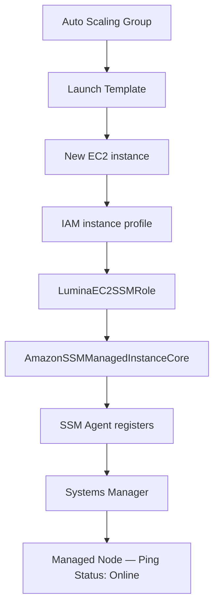

This is the central point of the design. In an Auto Scaling architecture, instances are created and destroyed continuously and unattended. Any access mechanism that requires a per-instance manual step — copying an SSH key, registering an IP, attaching a role by hand — fails immediately, because the instance an engineer needs to inspect at 3 a.m. may have been launched twenty minutes earlier by an automatic scaling event. Because the IAM instance profile is declared in the Launch Template, every instance the ASG launches, including replacements after a failure, becomes manageable through Session Manager automatically and with no manual configuration.

### 12.3 SSM Agent and verification

The SSM Agent on the instance establishes the connection to Systems Manager. Its status was verified with `sudo systemctl status amazon-ssm-agent`, expecting `Active: active (running)`, and it can be enabled at boot with `sudo systemctl enable amazon-ssm-agent`. The instance was then confirmed in the console under Systems Manager → Managed Nodes with **Ping Status: Online**.

An interactive session was opened from the console and validated with `hostname`, `whoami`, `pwd` and `uname -a`, and the application environment was inspected using `sudo systemctl status nginx` and `sudo ss -tulpn`. This confirms an administrator can reach and inspect a private instance without SSH.

### 12.4 Network requirements

Session Manager requires **outbound HTTPS on TCP 443** from the instance to the Systems Manager service endpoints. It requires **no inbound connection whatsoever**. For instances in private subnets, that outbound path is provided by the existing NAT Gateway via the private application route table.

This is what makes the model work: `ec2-sg` needs no inbound rule at all beyond port 80 from the ALB. There is no SSH port to attack, no bastion host to patch and secure, and no public IP on any application instance.

### 12.5 Separation of control plane and data plane

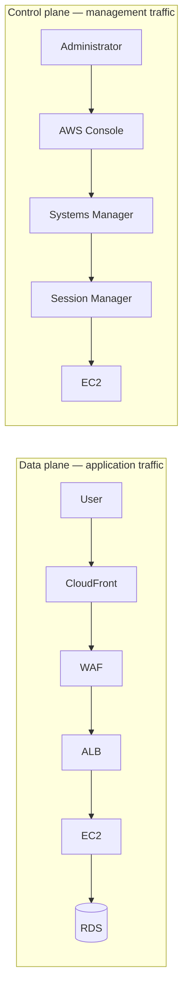

Systems Manager is not part of the public application request path. Administrative traffic enters through the AWS Console and the Systems Manager service, authenticated and authorised by IAM, and reaches the instance through the agent's outbound connection. Application traffic and management traffic therefore traverse entirely separate paths with entirely separate authorisation systems — a compromise of the web application does not yield administrative access, and administrative access does not depend on the web tier being reachable.

---

## 13. Monitoring and Alerting

### 13.1 SNS

An Amazon SNS topic was created as the notification destination for CloudWatch alarms, with the **email** protocol configured as the subscription endpoint. CloudWatch alarms publish state changes to the topic; SNS delivers them to the subscribed address.

### 13.2 Configured alarms

Seven alarms are configured across four services. All use a 5-minute period and all publish to the SNS topic.

| # | Service | Metric | Statistic | Period | Condition |
|---|---|---|---|---|---|
| 1 | Auto Scaling Group | `GroupInServiceInstances` | Minimum | 5 min | **< 2** |
| 2 | Application Load Balancer | `HTTPCode_ELB_4XX_Count` | Sum | 5 min | **> 5** |
| 3 | Target Group | `HealthyHostCount` | Minimum | 5 min | **< 2** |
| 4 | Target Group | `HTTPCode_Target_4XX_Count` | Sum | 5 min | **> 5** |
| 5 | Amazon RDS | `CPUUtilization` | Average | 5 min | **> 80%** |
| 6 | Amazon RDS | `DatabaseConnections` | Average | 5 min | **> 80** |
| 7 | Amazon RDS | `FreeStorageSpace` | Minimum | 5 min | **< 2,147,483,648 bytes (2 GB)** |

### 13.3 Why these metrics and statistics

The choices are deliberate and worth reading closely, because statistic selection changes what an alarm actually detects.

**`GroupInServiceInstances` with Minimum < 2** monitors the count of instances in the `InService` state within `dental-asg`. Because it is an ASG-level metric rather than a per-instance metric, it remains valid across instance replacement — the alarm does not break when the instance it was watching is terminated and replaced, which a per-instance alarm would. The **Minimum** statistic means the alarm fires if the count dropped below 2 at any point in the period, not merely if the average did.

**`HealthyHostCount` with Minimum < 2** covers a genuinely different failure mode from alarm 1. An instance can be `InService` from the ASG's perspective while failing the Target Group health check — for example if Nginx has stopped but the instance is still running. Alarm 1 detects missing capacity; alarm 3 detects capacity that exists but cannot serve traffic. Running both is not redundancy.

**`HTTPCode_ELB_4XX_Count` and `HTTPCode_Target_4XX_Count` with Sum > 5** likewise distinguish two sources. The ELB metric counts 4XX responses generated *by the load balancer itself*; the Target metric counts 4XX responses generated *by the backend instances*. A spike in one and not the other localises the fault immediately.

**RDS `FreeStorageSpace` with Minimum < 2 GB** uses Minimum precisely because the objective is detecting a critical low-water mark before storage exhaustion halts the database — an average would mask a sharp drop.

### 13.4 Alerting lifecycle

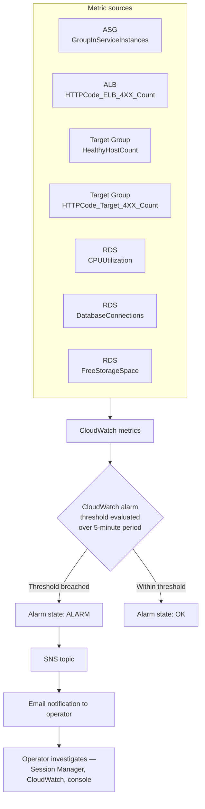

A worked example using the actual configuration: an EC2 instance stops responding on port 80. Within a few health-check cycles the ALB marks the target unhealthy and stops routing to it. `HealthyHostCount` drops to 1. Over the next 5-minute evaluation period the Minimum statistic registers 1, the alarm transitions to ALARM, and SNS delivers an email. In parallel, if the ASG terminates the instance, `GroupInServiceInstances` drops below 2 and alarm 1 also fires, until the replacement instance reaches `InService`.

### 13.5 Coverage gaps

The configured alarms cover instance count, load-balancer client errors, target health, target client errors, and three database dimensions. **Not configured, per the documentation:** EC2 CPU alarms (CPU is used by the target-tracking scaling policy, but no separate alarm is documented), ALB `TargetResponseTime` or latency alarms, `HTTPCode_Target_5XX_Count` or `HTTPCode_ELB_5XX_Count`, `UnHealthyHostCount`, `RejectedConnectionCount`, RDS `FreeableMemory`, `ReadLatency`/`WriteLatency`, or replica/failover events, and any CloudFront or WAF metrics.

The absence of **5XX alarms** is the most consequential of these, since 4XX responses generally indicate client-side errors while 5XX responses indicate the application or infrastructure failing — the condition an operator most needs to know about. This is raised in Section 26.

---

## 14. Request and Data Flow

### 14.1 End-to-end request lifecycle

The following describes the lifecycle **as actually implemented**. Note that step 2 in the generic pattern — Route 53 DNS resolution — does not apply here, because Route 53 was not deployed; resolution occurs against the AWS-generated endpoint.

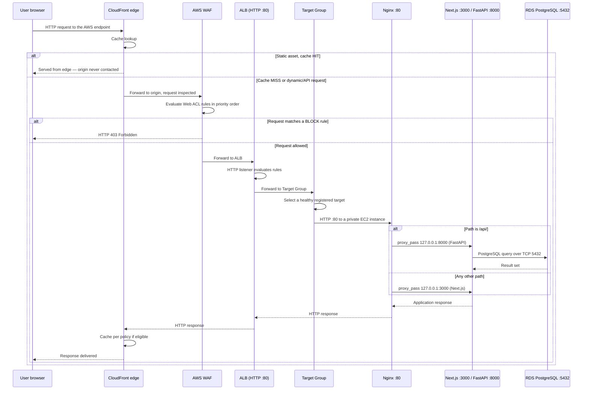

Step by step:

1. **User issues a request** to the application's public endpoint.
2. **DNS resolution** occurs against the AWS-generated endpoint. *(Route 53 with a custom domain is planned, not implemented.)*
3. **CloudFront** receives the request at the nearest edge location and performs a cache lookup. A hit for a cacheable static asset is returned immediately and the remaining steps do not execute.
4. **AWS WAF** inspects the request against the Web ACL in priority order. A match on a blocking rule terminates the request with HTTP 403 — as demonstrated by the `/admin` test.
5. **The Application Load Balancer** receives the allowed request on its HTTP listener.
6. **The listener** forwards to the configured Target Group.
7. **The Target Group** selects one of its healthy registered instances. Unhealthy targets are excluded.
8. **Nginx** on the selected instance receives the request on port 80 and applies its location rules.
9. **The application** handles the request: Next.js for page requests, FastAPI for `/api/` requests.
10. **FastAPI connects to RDS** over TCP 5432 via the RDS endpoint, for requests that require data.
11. **The response** returns along the same path, is cached by CloudFront if eligible, and is delivered to the client.

### 14.2 Control plane versus data plane

The distinction is structural in this architecture, not merely conceptual.

| | Data plane | Control plane |
|---|---|---|
| **Traffic** | End-user HTTP requests and responses | Administrative and management operations |
| **Path** | CloudFront → WAF → ALB → Target Group → EC2 → RDS | AWS Console → Systems Manager → Session Manager → SSM Agent → EC2 |
| **Authorisation** | WAF rules, Security Groups, application authn/authz | IAM (`LuminaEC2SSMRole`, console identity permissions) |
| **Direction** | Inbound to the instance | Established by the instance's outbound connection |
| **Diagram representation** | Solid connectors | Dashed connectors |

Other control-plane operations follow the same separation. Auto Scaling launching an instance, CloudWatch collecting metrics, SNS delivering a notification, and RDS performing a failover are all control-plane actions that occur through AWS service APIs, not through the application's network path. This is why the monitoring and management services on the right side of the architecture diagram are drawn with dashed lines and no position inside the VPC's traffic flow — they act on the infrastructure rather than sitting in it.

---

## 15. High Availability and Fault Tolerance

### 15.1 Redundancy inventory

| Layer | Redundancy implemented | Single point of failure? |
|---|---|---|
| Edge | CloudFront — globally distributed AWS-managed service | No |
| Load balancing | ALB deployed across two AZs; AWS-managed nodes | No |
| Compute | ASG, minimum 2 instances, two AZs, automatic replacement | No |
| Outbound connectivity | One NAT Gateway per AZ, zone-local routing | No |
| Database | Multi-AZ primary/standby as documented (see the qualification in 8.2) | Depends on Multi-AZ enablement |
| DNS | AWS-generated endpoint; Route 53 not implemented | Managed by AWS |

### 15.2 Failure scenario — EC2 instance failure

The response is layered, and the order matters:

1. The instance stops responding correctly on the Target Group health-check path.
2. After the configured consecutive failures, the ALB marks the target **unhealthy** and immediately stops routing new requests to it. **User impact ends here** for new requests — remaining healthy instances absorb the traffic.
3. `HealthyHostCount` falls to 1. The CloudWatch alarm (Minimum < 2) enters ALARM within its 5-minute evaluation period and SNS sends an email.
4. Depending on the health-check type configured on the ASG, the group may terminate the instance. If it does, `GroupInServiceInstances` falls below 2 and the second alarm fires.
5. The ASG launches a replacement from the Launch Template to return to desired capacity of 2.
6. The replacement boots from the Golden AMI with the application stack starting automatically (verified by the reboot test), receives `LuminaEC2SSMRole` via the instance profile, and is auto-registered with the Target Group.
7. Once it passes health checks, the ALB begins routing to it and the alarms return to OK.

With a minimum of 2 instances, the loss of one leaves the application available on the other throughout. Capacity is halved during the replacement window, which is the real cost of this scenario.

**Not documented:** whether the ASG health check type is set to `EC2` or `ELB`. This matters — with `EC2` health checks the group only replaces instances that fail EC2 status checks, so an instance whose Nginx has died but whose operating system is healthy would be removed from ALB rotation but **not** replaced by the ASG. Section 22 lists verifying this as an operational check.

### 15.3 Failure scenario — Availability Zone failure

The architecture genuinely supports this, and each layer contributes:

- **ALB:** deployed across both AZs; the nodes in the surviving zone continue accepting traffic.
- **Compute:** instances in the failed zone become unhealthy and leave rotation. The ASG can launch replacements in the surviving zone's subnet, subject to that zone having capacity for the requested instance type.
- **Outbound connectivity:** the surviving zone's instances use their own zone-local NAT Gateway, which is unaffected. This is precisely the dependency the two-NAT design was intended to eliminate.
- **Database:** if Multi-AZ is enabled, RDS fails over to the standby in the surviving zone.

**Honest qualification.** During an AZ failure the fleet's capacity is temporarily halved and all traffic concentrates on the surviving zone's instances. Whether the application remains performant, as opposed to merely available, depends on whether the surviving instances plus any scale-out can absorb the full load — which the documentation does not measure. Availability is preserved by design; performance under this scenario is not evidenced.

### 15.4 Failure scenario — database failure

If Multi-AZ is enabled, RDS detects the primary's failure, promotes the standby, and repoints the endpoint's DNS record to the new primary. Because the application connects to the RDS endpoint rather than an instance address, it reconnects to the promoted instance without configuration change.

Two realities should be stated rather than glossed over. First, failover is **not instantaneous** — there is a period, typically measured in tens of seconds, during which database connections fail. The application will surface errors during that window unless it implements connection retry logic, which the documentation does not describe. Second, if Multi-AZ is **not** in fact enabled on the deployed instance, database failure is a full outage recoverable only from a backup — and backup configuration is likewise undocumented (Section 8.5).

### 15.5 What the architecture does not protect against

Stated plainly, so the assessment is not overstated:

- **Regional failure.** All infrastructure is in a single AWS Region. There is no multi-region deployment, no cross-region replica, and no documented disaster-recovery plan.
- **Data corruption or accidental deletion.** Multi-AZ replicates faithfully — including a destructive statement. Only backups address this, and their configuration is undocumented.
- **Application-level defects.** A bug deployed into the AMI is deployed to every instance the ASG launches. Health checks detect a process that is down, not one that returns wrong answers.
- **Sustained load beyond 6 instances.** The maximum capacity is a hard ceiling.

---

## 16. Scalability Analysis

### 16.1 Horizontal scaling

Horizontal scaling is the architecture's primary scaling mechanism and is fully automated. The Auto Scaling Group adjusts the instance count between 2 and 6 in response to CPU utilisation under the target-tracking policy, and the ALB distributes requests across whatever healthy instances currently exist.

Three properties make this work, and all three are implementation details rather than defaults:

- **Statelessness.** EC2 instances hold no persistent application data. Any instance can serve any request, so adding one adds usable capacity immediately.
- **The Golden AMI.** A new instance is functionally identical to existing ones without configuration management running at boot, which keeps launch time to boot time.
- **Automatic registration.** The ASG–Target Group association means new capacity enters service without operator action.

### 16.2 Vertical scaling

Vertical scaling is available but manual. The instances are `t3.small`; moving to a larger type would give each instance more vCPU and memory. That change is made by creating a new Launch Template version with the new instance type and then replacing the running instances — for example through an instance refresh. It is not automatic and it requires instance replacement, since instance type cannot be changed on a running instance in place.

Vertical scaling for the database is also possible by modifying the RDS instance class, though the current class is not documented.

### 16.3 Capacity limits and what the maximum actually means

The ceiling of 6 instances defines the maximum compute capacity available to automatic scaling — three times the baseline of 2. **What that translates to in concurrent users or requests per second cannot be stated**, because it depends on request mix, the proportion of requests served from CloudFront cache, per-request CPU cost in Next.js and FastAPI, database query cost, and connection pool behaviour. The documentation records no load testing, so this report provides no user-capacity figure. Doing so would be fabrication.

What can be said is structural: at 6 instances the compute tier stops scaling automatically, and any further growth requires either raising the maximum, moving to a larger instance type, or reducing per-request cost.

### 16.4 Scalability limitations

**The database does not scale horizontally.** This is the architecture's principal scalability constraint. RDS is a single writable primary; the Multi-AZ standby takes no read traffic. Every one of the 2–6 application instances directs its queries to the same database instance. The compute tier can triple; the database cannot. The `DatabaseConnections > 80` alarm is well-placed precisely because connection pressure is the first symptom that usually appears — six instances each holding a connection pool multiply against one fixed connection limit.

**No caching layer for dynamic data.** There is no ElastiCache or equivalent, so repeated identical queries reach PostgreSQL every time.

**No connection pooling proxy.** RDS Proxy is not implemented, so connection management is entirely the responsibility of the application's own pooling.

**CloudFront does not relieve dynamic load.** Caching helps static assets only; API traffic scales linearly with users.

**Scale-out is not instantaneous.** A scale-out event requires metric evaluation, instance launch, boot, and health-check passes before the new instance carries traffic. Sudden load spikes are absorbed by the existing fleet during that interval.

---

## 17. Performance Architecture

The implemented performance mechanisms, and their actual effect:

**CloudFront edge caching.** Static assets served from an edge location avoid the round trip to the region entirely, reducing latency for those objects and removing that traffic from the ALB and instances. The effect is largest for users geographically distant from the deployment region and for asset-heavy pages — a Next.js frontend typically issues many static requests per page view, so the proportion of total requests eligible for caching is usually high even though they represent a smaller share of compute cost.

**ALB request distribution.** Spreading requests across healthy instances prevents any one instance from becoming a queueing bottleneck while others are idle, which keeps per-request latency lower than the same aggregate load on fewer instances.

**Horizontal scaling.** Target tracking adds capacity as CPU rises, which addresses the specific performance degradation caused by CPU saturation. It does not address latency caused by database contention, I/O, or slow queries — capacity added at the compute tier does not relieve pressure at the data tier.

**Nginx as reverse proxy.** Nginx handles connection acceptance and proxying in front of the application processes, and serving both the frontend and API through one origin avoids cross-origin preflight overhead on API calls.

**Loopback backend communication.** Nginx-to-FastAPI traffic traverses the loopback interface rather than the network, so the proxy hop between them carries no network latency.

**Network placement.** EC2 and RDS are in the same VPC and, per zone, in adjacent subnets. Database traffic is VPC-local and does not traverse a NAT Gateway or the internet.

**Static versus dynamic separation.** Because dynamic and API responses are deliberately excluded from asset-style caching, correctness is preserved at the cost of those requests always reaching the origin — the right trade-off, but it means dynamic performance rests entirely on the compute and database tiers.

No latency, throughput, or cache-hit-ratio measurements exist in the documentation, so no quantitative performance claims are made.

---

## 18. Security, Availability and Cost Trade-offs

**Two NAT Gateways instead of one.** Availability was chosen over cost. A single gateway would have halved that line item but created a cross-AZ dependency that would compromise the multi-AZ design during a zone failure — instances in the healthy zone would lose Systems Manager connectivity and outbound access. Given that NAT Gateways are among the most significant fixed costs in this architecture, this is the most expensive availability decision in the design, and it is the correct one for an architecture whose stated purpose is surviving zone failure.

**Private compute plus Session Manager instead of a bastion host.** Security and operational simplicity were chosen together, at the cost of depending on outbound NAT connectivity. A bastion host would have added an instance to run, patch, and secure, plus SSH key distribution. Session Manager eliminates all of it and produces a better security posture — no inbound SSH anywhere. The trade-off is a hard dependency on NAT egress: if outbound connectivity fails, so does administrative access.

**Minimum capacity of 2 instead of 1.** Availability over cost. A minimum of 1 would halve baseline compute spend but would mean any instance failure is a full outage until replacement completes. Minimum 2 makes single-instance failure a capacity event rather than an availability event. This is the single most effective availability decision in the architecture relative to its cost.

**Multi-AZ RDS instead of Single-AZ.** Availability over cost — Multi-AZ approximately doubles database instance cost for a standby that serves no traffic. It buys automatic failover without data loss for infrastructure-level database failure, which for an application with a single writable database is the difference between a brief interruption and an extended outage.

**Maximum capacity of 6.** Cost control over unbounded scalability. The ceiling bounds the maximum bill during a traffic spike or an attack — including one that the COUNT-mode rate rules would observe but not block. The cost is that genuine demand beyond six instances is not served.

**WAF COUNT mode on three rules.** Availability over security, deliberately and temporarily. Blocking rules tuned without traffic data produce false positives that block real users; COUNT mode gathers that data first. The cost, stated plainly, is that rate-based abuse and oversized payloads are currently unmitigated. This trade-off is reasonable only while it remains temporary.

**Managed services throughout — RDS, ALB, NAT Gateway, CloudFront, WAF.** Operational simplicity and reliability over cost and control. Self-managed equivalents would be cheaper and more configurable; they would also require patching, failover engineering, and monitoring that a small team is unlikely to do as well as AWS does.

**HTTP without TLS.** This is not a trade-off the project chose on the merits — it is a consequence of the domain constraint documented in Section 11. It should be treated as an unresolved gap, not an accepted position.

---

## 19. AWS Services Used

| AWS Service | Purpose | Configuration / Role | Architectural Importance |
|---|---|---|---|
| **Amazon VPC** | Network isolation boundary | `aws-project-vpc`, `10.0.0.0/16`, 6 subnets across 2 AZs, 5 route tables | Foundation — defines every security and availability boundary |
| **Internet Gateway** | Internet connectivity for public subnets | `aws-project-igw`, attached to VPC; `0.0.0.0/0` route in `public-rt` | Required for ALB ingress and NAT egress |
| **NAT Gateway** | Outbound-only internet access for private subnets | `nat-gateway-az1`, `nat-gateway-az2`, one per AZ, each with a dedicated EIP | Enables SSM and outbound calls without inbound exposure; per-AZ design removes cross-zone dependency |
| **Amazon EC2** | Application compute | `t3.small` instances from the custom Golden AMI, in private application subnets | Runs Nginx, Next.js and FastAPI; stateless and disposable |
| **EC2 Launch Template** | Standardised instance definition | Custom AMI, instance type, `ec2-sg`, IAM instance profile | Guarantees every instance is identical — prerequisite for scaling |
| **EC2 Auto Scaling Group** | Capacity management and self-healing | `dental-asg`; min 2 / desired 2 / max 6; multi-AZ; target-tracking on CPU | Provides both horizontal scalability and automatic instance replacement |
| **Application Load Balancer** | Layer 7 public entry point | Internet-facing, multi-AZ, HTTP listener, `alb-sg` | Decouples users from instances; enables private compute |
| **ALB Target Group** | Target registration and health evaluation | Instance type, HTTP:80, health checks enabled, bound to the ASG | Where health state is determined and failed instances are excluded |
| **Amazon RDS (PostgreSQL)** | Managed relational database | Private DB subnets, TCP 5432, `rds-sg`, Multi-AZ primary/standby as documented | Holds all persistent state; makes the compute tier stateless |
| **Amazon CloudFront** | Edge delivery and static caching | Distribution with the ALB as origin | Reduces latency for static assets and offloads repeated static traffic from the origin |
| **AWS WAF** | Layer 7 request inspection | Web ACL with 4 AWS managed rule groups + 5 custom rules; 3 rules in COUNT mode | First application-layer security boundary; validated by sampled requests |
| **AWS Systems Manager** | Secure administrative access | Session Manager via SSM Agent and `LuminaEC2SSMRole` | Removes SSH, bastion hosts and public IPs from the architecture |
| **AWS IAM** | Instance permissions | Role `LuminaEC2SSMRole` with `AmazonSSMManagedInstanceCore`, attached via the Launch Template | Makes every auto-launched instance manageable without manual setup |
| **Amazon CloudWatch** | Metrics and alarms | 7 alarms across ASG, ALB, Target Group and RDS; 5-minute periods | The architecture's entire observability layer |
| **Amazon SNS** | Notification delivery | Topic with an email subscription, subscribed by all alarms | Converts alarm state changes into operator awareness |
| **Security Groups** | Instance-level stateful firewall | `alb-sg`, `ec2-sg`, `rds-sg` — chained by Security Group reference | Enforces tier-to-tier authorisation independent of IP addressing |
| **Amazon EBS** | Instance root storage | AMI-based root volume configuration | Carries the application image on each instance |
| *Amazon Route 53* | *DNS — **NOT IMPLEMENTED*** | *Planned: Hosted Zone with Alias A record to the ALB* | *Would provide a custom domain; prerequisite for ACM/HTTPS* |
| *AWS Certificate Manager* | *TLS certificates — **NOT IMPLEMENTED*** | *Planned: public certificate on an ALB HTTPS listener* | *Would provide transport encryption* |

---

## 20. Architecture Decision Records

**ADR-1 — EC2 with Auto Scaling rather than serverless compute**
*Decision:* Run the application on EC2 instances managed by an Auto Scaling Group.
*Reason:* The application is a conventional server stack — Nginx, a long-running Next.js process, and Uvicorn — which maps directly onto instance-based compute and required no re-architecture to deploy.
*Benefit:* The existing application ran unchanged; full control over the runtime environment; predictable behaviour.
*Trade-off:* Instances are billed while idle, patching and AMI lifecycle are the team's responsibility, and scale-out takes as long as an instance takes to boot and pass health checks.

**ADR-2 — Golden AMI as the deployment artefact**
*Decision:* Capture a validated instance as an AMI and use it as the Launch Template source.
*Reason:* Every instance must be identical, and configuration work must not occur at launch time.
*Benefit:* Fast, deterministic launches; no configuration drift between instances; the reboot test validates that instances come up unattended.
*Trade-off:* Any application change requires building a new AMI, creating a new Launch Template version, and replacing running instances. Without automation this is a manual release process, and configuration baked into the image — including database credentials — is difficult to rotate.

**ADR-3 — Application Load Balancer instead of direct EC2 exposure**
*Decision:* Publish the application only through an ALB.
*Reason:* A stable public entry point independent of instance lifetime, plus health-based routing.
*Benefit:* Instances can live in private subnets with no public IPs; failed instances leave rotation automatically; the ALB is the natural place to terminate TLS later.
*Trade-off:* An additional always-on cost and one more component in the request path.

**ADR-4 — Private subnets for compute, with a dedicated isolated tier for the database**
*Decision:* Three subnet tiers rather than two.
*Reason:* Application instances need outbound internet access; the database needs none and should have no internet route at all.
*Benefit:* Route-level isolation for the database that is independent of Security Group correctness; a clean DB subnet group spanning two AZs.
*Trade-off:* More subnets and route tables to manage; outbound access for the compute tier depends on NAT Gateways.

**ADR-5 — Security Group references instead of CIDR-based rules**
*Decision:* `ec2-sg` admits `alb-sg`; `rds-sg` admits `ec2-sg`.
*Reason:* Instance IP addresses change continuously under Auto Scaling.
*Benefit:* Authorisation follows group membership, so new instances are authorised automatically and nothing outside the group ever is; no rule maintenance as the fleet changes.
*Trade-off:* Requires understanding that authorisation is identity-based rather than address-based when auditing the configuration.

**ADR-6 — One NAT Gateway per Availability Zone**
*Decision:* Deploy two NAT Gateways with zone-local routing.
*Reason:* Avoid making the private tier in one zone dependent on infrastructure in another.
*Benefit:* A zone failure does not remove outbound connectivity — including Systems Manager access — from the surviving zone.
*Trade-off:* Roughly doubles NAT Gateway cost, which is a significant share of the fixed monthly spend.

**ADR-7 — Amazon RDS Multi-AZ rather than a self-managed or single-AZ database**
*Decision:* Managed PostgreSQL with a synchronous standby.
*Reason:* The database is the only stateful component and therefore the highest-consequence single point of failure.
*Benefit:* Automatic failover with the application unchanged, because it addresses the RDS endpoint; patching, backups and replication are AWS-managed.
*Trade-off:* Approximately double the instance cost for a standby that serves no traffic; failover is not instantaneous; the standby provides no read scaling.

**ADR-8 — Systems Manager Session Manager instead of SSH**
*Decision:* No inbound SSH, no bastion host, no public IPs on application instances.
*Reason:* SSH access does not compose with a fleet of instances that are created and destroyed automatically.
*Benefit:* No SSH attack surface; access is governed by IAM and applies automatically to every new instance via the Launch Template; no keys to distribute or rotate.
*Trade-off:* Depends on outbound NAT connectivity and on the SSM Agent being healthy; access requires the AWS Console or CLI rather than a plain SSH client.

**ADR-9 — CloudFront in front of the ALB**
*Decision:* Serve the application through a CloudFront distribution with the ALB as origin.
*Reason:* Reduce latency for static assets and offload repeated static requests from the origin.
*Benefit:* Edge delivery close to users; lower origin load; a natural place to attach a global Web ACL.
*Trade-off:* An additional layer to reason about for cache correctness; dynamic content gains little; per-request and data-transfer cost.

**ADR-10 — AWS WAF with managed rule groups, three rules in COUNT mode**
*Decision:* Deploy managed Common, SQLi, Admin Protection and Anti-DDoS rule groups plus custom IP, geo, rate and body-size rules, with Anti-DDoS, rate-based and body-size rules initially in COUNT.
*Reason:* Managed rule groups provide maintained coverage without hand-writing signatures; COUNT mode allows observation before enforcement.
*Benefit:* Immediate blocking of SQLi and common exploits; measured rollout of the more disruptive rules; sampled requests give real evidence of behaviour.
*Trade-off:* Three protections are currently observational only; the Admin Protection group blocks the application's own admin panel, an unresolved conflict (Section 9.7); WAF adds per-request cost.

**ADR-11 — CloudWatch alarms delivered through a single SNS email topic**
*Decision:* Seven alarms across four services, all publishing to one topic with an email subscription.
*Reason:* Provide operator awareness of infrastructure conditions without additional tooling.
*Benefit:* Simple, low-cost, immediate; the metric and statistic choices distinguish genuinely different failure modes.
*Trade-off:* Email is not an on-call escalation path — there is no acknowledgement, routing, or paging; no 5XX or latency alarms are configured; alerts have no aggregation, so a broad failure produces a burst of separate messages.

---

## 21. Deployment and Operations

### 21.1 Implementation sequence

The project was built in phases, and the documented order reflects a sound dependency chain: application first, then image, then compute automation, then the layers in front of it, then security and observability.

**Phase 1 — Application server preparation (pre-AMI).** A single EC2 instance was provisioned and the full stack installed: the Next.js frontend, the FastAPI backend with its Python virtual environment and Uvicorn, Nginx as reverse proxy, all application dependencies, application configuration and environment variables, and the connectivity configuration to RDS PostgreSQL.

**Phase 2 — Database migration to RDS.** The database was moved off the instance to Amazon RDS PostgreSQL, and the backend configured to connect to the RDS endpoint on port 5432. This is the step that makes the instance stateless and everything after it possible.

**Phase 3 — Nginx routing configuration.** `/etc/nginx/conf.d/lumina.conf` was created with the `/` → `127.0.0.1:3000` and `/api/` → `127.0.0.1:8000` proxy rules, loaded automatically by the `include` directive in `nginx.conf`.

**Phase 4 — Validation.** Backend health verified with `curl http://127.0.0.1:8000` returning `{"status":"ok","service":"Lumina Dental API"}`; frontend confirmed through the instance's public IP; end-to-end frontend → Nginx → FastAPI → RDS flow confirmed; listening sockets confirmed on 80, 3000, 8000.

**Phase 5 — Reboot test.** The instance was rebooted and Nginx, Next.js and FastAPI/Uvicorn all returned successfully — the gate that qualifies the instance to become a scaling source.

**Phase 6 — Networking build-out.** VPC `aws-project-vpc` (`10.0.0.0/16`); six subnets across two AZs; `aws-project-igw`; `nat-gateway-az1` and `nat-gateway-az2` with dedicated Elastic IPs; five route tables with their subnet associations.

**Phase 7 — Security Groups.** `alb-sg`, `ec2-sg` and `rds-sg` created and chained by Security Group reference, with SSH and direct internet access to the compute and database tiers deliberately omitted.

**Phase 8 — Golden AMI creation.** The validated instance was captured as the custom application AMI.

**Phase 9 — Launch Template.** Created from the AMI with instance type `t3.small`, `ec2-sg`, and the IAM instance profile for `LuminaEC2SSMRole`.

**Phase 10 — Target Group and ALB.** Target Group created (instance type, HTTP:80, health checks enabled); Application Load Balancer created with an HTTP listener forwarding to the Target Group.

**Phase 11 — Auto Scaling Group.** Created against the Launch Template with min 2 / desired 2 / max 6, associated with the private application subnets in both AZs and with the Target Group, and configured with a target-tracking CPU scaling policy. Application access was then tested through the ALB rather than a direct EC2 public IP.

**Phase 12 — Systems Manager.** IAM role `LuminaEC2SSMRole` created with `AmazonSSMManagedInstanceCore` and attached through the Launch Template; SSM Agent status verified; the instance confirmed Online under Managed Nodes; an interactive session opened and validated.

**Phase 13 — CloudFront.** Distribution created with the ALB as origin, with caching applied to static content and dynamic/API requests forwarded to the origin.

**Phase 14 — AWS WAF.** Web ACL configured with the four managed rule groups and five custom rules; behaviour validated through sampled requests, including the `/admin` block and the observed scanner traffic.

**Phase 15 — Monitoring.** SNS topic created with an email subscription; seven CloudWatch alarms configured across the ASG, ALB, Target Group and RDS, all publishing to the topic.

### 21.2 Deployment lifecycle for application changes

```mermaid
flowchart LR
    A[Change application code] --> B[Update a source instance<br/>and validate]
    B --> C[Create new AMI]
    C --> D[New Launch Template version]
    D --> E[Point ASG at the new version]
    E --> F[Replace instances<br/>e.g. instance refresh]
    F --> G[New instances register<br/>with Target Group]
    G --> H[Health checks pass]
    H --> I[ALB routes to new version]
```

This lifecycle is inherent to the AMI-based model. The documentation does not record an automated pipeline for it, so it should be understood as a manual process in the current implementation — see Sections 25 and 26.

---

## 22. Operational Workflow

### 22.1 Accessing an instance

Administrative access is through **Systems Manager Session Manager**: AWS Console → Systems Manager → Managed Nodes → select the instance → Start session. No SSH client, key, public IP or bastion host is involved. Instances appear as managed nodes automatically because the Launch Template attaches `LuminaEC2SSMRole`.

If an instance does **not** appear under Managed Nodes, the causes follow directly from the requirements in Section 12: the SSM Agent is not running (`sudo systemctl status amazon-ssm-agent`), the instance profile is missing, or outbound HTTPS on 443 through the NAT Gateway is unavailable.

### 22.2 Checking application health

From within a session, the commands the project already used during build-out remain the right first checks:

```bash
sudo systemctl status nginx        # reverse proxy running?
sudo ss -tulpn                     # are 80, 3000 and 8000 listening as expected?
curl http://127.0.0.1:8000         # backend responding? expect {"status":"ok",...}
curl -I http://127.0.0.1:3000      # frontend responding?
```

At the infrastructure level, target health is read from the ALB Target Group console page, which shows each registered instance's health state and the reason for any failure — the fastest way to distinguish "the instance is down" from "the instance is up but failing the health check".

### 22.3 Responding to each configured alarm

Because there are exactly seven alarms, each has a determinate first response:

| Alarm | Likely meaning | First action |
|---|---|---|
| `GroupInServiceInstances < 2` | An instance was terminated and replacement is in progress, or launches are failing | Check ASG Activity History for launch failures — capacity, subnet, or AMI errors |
| `HealthyHostCount < 2` | An instance is running but failing health checks | Open the Target Group, read the failure reason, then Session Manager into the instance and check Nginx and the app processes |
| `HTTPCode_ELB_4XX_Count > 5` | Malformed requests, or requests the ALB itself rejected | Correlate with WAF sampled requests and ALB access logging, if enabled |
| `HTTPCode_Target_4XX_Count > 5` | The application is returning client errors | Inspect application behaviour; check whether a WAF change or a routing change preceded it |
| `RDS CPUUtilization > 80%` | Expensive queries or load beyond database capacity | Review query patterns; consider instance class or query optimisation |
| `RDS DatabaseConnections > 80` | Connection pressure — often connection-pool multiplication across scaled-out instances | Check current instance count and per-instance pool size |
| `RDS FreeStorageSpace < 2 GB` | Storage approaching exhaustion | Act immediately — increase allocated storage; storage exhaustion stops the database |

### 22.4 Handling an unhealthy instance

The ALB removes an unhealthy target from rotation automatically, so the first operational question is not "how do I stop traffic" but "why did it fail". Session Manager into the instance and check whether Nginx is running, whether the Next.js and FastAPI processes are listening, and whether the instance can reach RDS on 5432. If the fault is not diagnosable quickly, terminating the instance is a valid response — the ASG launches a clean replacement from the AMI, which is the intended behaviour of a disposable compute tier. Diagnosis matters when the fault is likely to recur on the replacement.

### 22.5 Handling scaling events

Scaling activity is visible in the ASG's Activity History, which records every launch and termination and the reason for it. During a scale-out, the sequence to expect is launch → registration in the Target Group → health checks → traffic. An instance stuck in an unhealthy state after launch usually indicates that the AMI or application configuration has drifted from what the health check expects.

### 22.6 Configuration verification checks worth performing

The documentation leaves several settings unrecorded that an operator should confirm, because each changes the failure behaviour described in Section 15:

- **RDS Multi-AZ** — confirm the setting is enabled on the DB instance (Section 8.2).
- **RDS backup retention** — confirm automated backups are enabled and note the retention period (Section 8.5).
- **ASG health check type** — confirm whether it is `EC2` or `ELB`; with `EC2` only, an instance with a dead Nginx will be removed from rotation but never replaced (Section 15.2).
- **Target Group health-check path** — confirm which path is configured and whether it exercises the API and database path (Section 6.4).
- **Network ACLs** — confirm whether custom NACLs exist or the VPC defaults remain (Section 9.3).

### 22.7 Logging — a gap in the operational model

The documentation records no centralised logging. There is no CloudWatch Logs agent on the instances, no ALB access logging to S3, no WAF logging destination, and no RDS log export documented. In practice this means application and Nginx logs live only on the instance that produced them — and that instance may be terminated by a scaling event or by the ASG replacing it, taking its logs with it. Investigating a fault therefore requires reaching the instance before it is replaced.

This is the most significant operational limitation in the architecture and is addressed in Sections 25 and 26.

---

## 23. Failure Scenarios and Recovery

| Failure scenario | Detection mechanism | AWS component response | Application impact | Recovery |
|---|---|---|---|---|
| Single EC2 instance stops responding on port 80 | Target Group HTTP health check; `HealthyHostCount < 2` alarm → SNS email | ALB marks target unhealthy and stops routing to it; ASG may terminate and replace it (subject to health check type) | None to availability — remaining instance serves traffic; capacity halved during replacement | ASG launches a replacement from the Launch Template; auto-registered; serves traffic once healthy |
| Application process fails but the OS remains healthy | Target Group health check; `HealthyHostCount` alarm | ALB removes the target from rotation. Replacement occurs **only if** the ASG health check type is `ELB` | Reduced capacity; no availability loss with 2+ instances | Verify ASG health check type; otherwise terminate the instance manually to trigger replacement |
| Instance count drops below baseline | `GroupInServiceInstances < 2` alarm → SNS email | ASG launches instances to restore desired capacity | Reduced capacity | Automatic; investigate ASG Activity History if launches fail |
| CPU rises under load | Target-tracking policy on CPU utilisation | ASG scales out toward the maximum of 6; new instances register with the Target Group | Temporary latency increase until new capacity is healthy | Automatic; scales back in when load falls, never below 2 |
| Availability Zone failure | Health checks; instance-count and healthy-host alarms | ALB serves from nodes in the surviving AZ; ASG can launch replacements there; surviving AZ's NAT Gateway unaffected; RDS fails over to the standby if Multi-AZ is enabled | Capacity halved; brief database interruption during failover | Automatic within the surviving AZ; full capacity restored when the AZ recovers or as the ASG launches replacements |
| RDS primary instance failure | RDS internal detection; RDS CPU/connection alarms may fire | Multi-AZ failover promotes the standby and repoints the endpoint DNS record | Database errors for the duration of failover unless the application retries | Automatic if Multi-AZ is enabled. **If not enabled, recovery depends on backups — configuration undocumented** |
| Database storage exhaustion | `FreeStorageSpace < 2 GB` alarm → SNS email | None automatic — no autoscaling of storage is documented | Database halts if storage is fully consumed | Manual: increase allocated storage before exhaustion |
| Database connection saturation | `DatabaseConnections > 80` alarm → SNS email | None automatic | New connections fail; requests error | Manual: reduce per-instance pool sizes, optimise queries, or scale the DB instance |
| Malicious or malformed Layer 7 request | AWS WAF rule evaluation; sampled requests | Blocking rules return HTTP 403 before the request reaches the ALB path | Legitimate requests unaffected. **Note:** false positives are possible — the Admin Protection rule currently blocks the legitimate `/admin` panel | Review sampled requests; implement the planned scoped Admin exception |
| Volumetric or rate-based Layer 7 abuse | `GlobalRateBasedRule` and `AntiDDoSRuleSet` — **COUNT mode** | Matches are counted, **not blocked** | Traffic reaches the origin; ASG scales out, bounded at 6 instances | Manual: switch the rules to BLOCK once count data supports a threshold |
| Elevated 5XX errors from the application | **No alarm configured** | None | Users see errors; no automated notification | Detected only by user report or manual inspection — see Section 26 |
| Outbound connectivity failure in one AZ | Instances lose SSM registration; may lose external calls | Zone-local NAT design confines the impact to that AZ | Administrative access to that zone's instances lost; application traffic unaffected | Investigate the NAT Gateway and route table for that AZ |
| Region-wide failure | — | **None — single-region architecture** | Full outage | No documented disaster-recovery procedure |
| Data corruption or accidental deletion | — | **None — Multi-AZ replicates the change faithfully** | Data loss | Restore from backup — backup configuration undocumented |

---

## 24. Cost Considerations

No cost estimate, budget, or billing data is included in the project documentation, apart from one figure: AWS displayed an estimated **AWS WAF cost of approximately $42–$43 per 10 million requests per month**, with the documentation correctly noting that actual billing varies with request volume, WAF configuration, managed rule usage and other AWS pricing factors. **No other prices are stated in this report, because none are supported by the source material.**

What can be described accurately is the *shape* of the cost — which components drive it and why.

**Fixed costs — incurred continuously regardless of traffic:**

- **NAT Gateways (×2).** Billed per hour plus per GB processed, and running two of them doubles the hourly component. In architectures of this shape, NAT Gateways are frequently the largest single fixed cost, ahead of the compute they serve. This is the direct financial consequence of the per-AZ availability decision in ADR-6.
- **Amazon RDS with Multi-AZ.** The standby is billed as a second instance while serving no traffic, so Multi-AZ approximately doubles database instance cost. Storage and I/O are additional.
- **Application Load Balancer.** Billed per hour plus capacity units reflecting connections, requests and processed bytes.
- **EC2 instances.** A minimum of two `t3.small` instances run at all times, plus their EBS root volumes. This is the floor of compute cost; the ceiling is six.
- **Elastic IPs.** Two, attached to the NAT Gateways.

**Variable costs — scale with traffic:**

- **CloudFront.** Data transfer out to the internet plus per-request charges, varying by edge location region.
- **AWS WAF.** Per Web ACL, per rule, and per million requests inspected — the documented estimate above.
- **EC2 scale-out.** Each additional instance above the baseline of 2, up to 6.
- **NAT Gateway data processing.** Per GB of outbound instance traffic.
- **Data transfer.** Including cross-AZ traffic where it occurs.

**Minor costs:** CloudWatch alarms (seven, billed per alarm per month), SNS email notifications, and AMI/EBS snapshot storage.

Three observations follow from this structure. First, the architecture's cost is dominated by **fixed** components — two NAT Gateways, a Multi-AZ database, an ALB, and two always-on instances — rather than by traffic. At low traffic the bill is largely insensitive to usage. Second, the availability decisions documented in Section 18 are precisely the expensive ones: the second NAT Gateway, the RDS standby, and the second baseline instance all exist to remove single points of failure and all cost money continuously. Third, the maximum capacity of 6 acts as a spend ceiling on the compute tier during traffic spikes.

Exact monthly cost depends on region, instance classes, storage allocation, traffic volume, cache hit ratio and current AWS pricing, none of which are recorded in the documentation. Any figure quoted here would be invented.

---

## 25. Limitations of the Current Architecture

These are stated against the architecture as actually implemented.

**1. No transport encryption (HTTP only).** No ACM certificate and no HTTPS listener exist, because no domain was purchased. Client-to-ALB traffic is unencrypted. For an application that involves an authenticated admin panel, this is the most serious security gap in the deployment.

**2. No custom domain.** The application is reached via the AWS-generated endpoint. This is both an operational limitation and the blocking dependency for item 1.

**3. Database credentials are not managed by a secrets service.** The documentation identifies Secrets Manager as the correct production mechanism but records it as not implemented. Credentials therefore live in application configuration captured in the AMI, which makes rotation difficult and means anyone who can launch an instance from the AMI can read them.

**4. No centralised logging.** No CloudWatch Logs, no ALB access logs, no WAF logging destination, no RDS log export. Logs are local to instances that may be terminated at any time by a scaling event — see Section 22.7.

**5. Three WAF rules are observational only.** Anti-DDoS, global rate limiting and body-size restriction are in COUNT mode. Rate-based abuse and oversized payloads are recorded, not blocked.

**6. The Admin Protection rule blocks the legitimate admin panel.** `/admin` currently returns 403 through the WAF-protected path. The scoped exception, the `lumina-admin-allowed-ips` IP set, and the rule-priority review are all still planned.

**7. No 5XX or latency alarms.** The alarm set covers 4XX responses but not server errors or response time — the signals that most directly indicate the application is failing.

**8. The database is a scaling bottleneck.** A single writable primary serves all 2–6 application instances. No read replicas, no ElastiCache, no RDS Proxy for connection pooling.

**9. Manual, image-based deployment.** No CI/CD pipeline is documented. Shipping a change means updating an instance, building an AMI, versioning the Launch Template, and replacing instances by hand.

**10. No Infrastructure as Code.** The environment is documented in prose rather than defined in CloudFormation, CDK or Terraform, so it cannot be reproduced deterministically or reviewed as code.

**11. Single-region deployment with no documented disaster recovery.** No cross-region strategy, no documented RTO or RPO.

**12. Backup configuration is undocumented.** Multi-AZ addresses infrastructure failure, not data loss. No backup retention, snapshot schedule or restore test is recorded.

**13. Several operationally significant settings are unrecorded.** Health-check path and thresholds, ASG health check type, target-tracking CPU target, RDS instance class and storage, cache policy and TTLs, and NACL configuration. Each affects failure behaviour, as noted in Section 22.6.

**14. No shared storage layer.** The documentation describes the instances as stateless and records no S3 or EFS integration. If the application writes any files to local disk, that content would neither be shared across instances nor survive instance replacement. The documentation does not state either way, so this is flagged as a question to verify rather than a confirmed defect.

**15. Unverified Multi-AZ enablement.** As set out in Section 8.2, Multi-AZ is documented and diagrammed as the architecture, but no verification of the setting appears in the documentation.

**16. NACLs are claimed in the diagram but not documented.** No Network ACL rules appear anywhere in the source material (Section 9.3).

---

## 26. Future Improvements — **RECOMMENDATIONS**

> Everything in this section is a recommendation. **None of it is currently deployed.**

### Priority 1 — Security and correctness

- **Acquire a domain, create a Route 53 Hosted Zone with an Alias A record to the ALB, issue an ACM certificate, add an HTTPS listener on 443, and redirect port 80 to 443.** This single chain closes limitations 1 and 2, and the implementation path is already fully specified in the project documentation.
- **Implement the planned AdminProtection exception** with the `lumina-admin-allowed-ips` IP set, positioned so that authorised admin traffic is still evaluated by the Common and SQLi rule sets. Avoid a broad terminating `ALLOW`, exactly as the documentation warns.
- **Move database credentials to AWS Secrets Manager**, retrieved at runtime through the existing EC2 IAM role, so credentials are neither baked into the AMI nor static.
- **Transition the COUNT-mode WAF rules to BLOCK** once the counters provide enough data to set thresholds that do not affect legitimate traffic.

### Priority 2 — Observability

- **Add 5XX alarms** — `HTTPCode_Target_5XX_Count` and `HTTPCode_ELB_5XX_Count` — and an ALB `TargetResponseTime` latency alarm. These are the most valuable additions to the existing alarm set.
- **Enable centralised logging:** the CloudWatch Logs agent for Nginx and application logs, ALB access logs to S3, and WAF logging to a destination that supports querying. This directly addresses the loss of logs on instance termination.
- **Build a CloudWatch dashboard** consolidating the existing metrics, so an operator has one view rather than seven alarms.
- **Enable RDS Enhanced Monitoring and Performance Insights** to make database latency diagnosable rather than merely alarmable.
- **Route alarms to a real escalation path** — an on-call tool or chat integration — rather than email alone.

### Priority 3 — Resilience and data protection

- **Confirm and document RDS Multi-AZ, backup retention and automated backups**, and perform a restore test. An untested backup is an assumption.
- **Add AWS Backup** for centralised, policy-driven backup management.
- **Review the ASG health check type** and set it to `ELB` so that application-level failures trigger replacement, not only removal from rotation.
- **Point the Target Group health check at a path that exercises the API**, so that a healthy target means a target that can actually serve requests end to end.
- **Define a disaster-recovery position** — even explicitly accepting single-region risk with a documented RTO and RPO is better than leaving it undefined.

### Priority 4 — Scalability and performance

- **Add RDS Proxy** to pool and multiplex database connections, directly addressing the connection pressure the `DatabaseConnections > 80` alarm exists to detect.
- **Add ElastiCache** for frequently read, infrequently changing data, to reduce load on the single database primary.
- **Consider RDS read replicas** if the read/write ratio justifies it — the only way to scale reads horizontally in this architecture.
- **Move static assets and any user-uploaded files to S3**, optionally as an additional CloudFront origin. This would remove static-file serving from the instances entirely and resolve limitation 14.
- **Run load testing** to establish real capacity figures, so that the maximum of 6 can be validated rather than assumed.

### Priority 5 — Operational maturity

- **Define the infrastructure as code** using Terraform or CDK, making the environment reproducible and reviewable.
- **Build a CI/CD pipeline** that automates AMI creation, Launch Template versioning and instance refresh — replacing the manual release process in Section 21.2.
- **Add VPC endpoints for Systems Manager** (`ssm`, `ssmmessages`, `ec2messages`), which would remove the dependency on NAT Gateway egress for administrative access and reduce NAT data-processing cost.
- **Restrict ALB ingress to CloudFront** so the origin cannot be reached directly, bypassing the edge layer.
- **Consider containerisation (ECS or EKS)** as a longer-term path, if deployment speed and image lifecycle management become limiting.

---

## 27. Architecture Diagram Explanation

### 27.1 What the diagram shows

Reading the uploaded diagram from top to bottom:

**Above the AWS Cloud boundary** sits the **Users** icon — external clients, outside all AWS controls.

**Inside the AWS Cloud boundary but outside the VPC** are three global-scope services. **Amazon Route 53 (DNS)** is drawn first in the path. **Amazon CloudFront** sits below it, receiving the resolved traffic. **AWS WAF**, labelled *(OWASP Top 10 Rules)*, is drawn to the right of CloudFront with a **bidirectional arrow** between them, indicating that request inspection happens as part of the CloudFront request path rather than as a separate hop. Their placement outside the VPC rectangle is technically correct: CloudFront and WAF are global services with no presence in the VPC's address space.

**The VPC boundary** is labelled `10.0.0.0/16` and contains two vertical Availability Zone regions, AZ A and AZ B, drawn as dashed blue containers.

**Public subnets** (`10.0.1.0/24` in AZ A, `10.0.2.0/24` in AZ B) are drawn in green with padlock icons and each contains a **NAT Gateway**. The **Application Load Balancer** is drawn between the two public subnets with arrows pointing into it from both — representing an ALB that has nodes in both public subnets, which is why it is drawn spanning rather than inside either one.

**Private subnets** (A and B) are drawn in blue with padlocks, each containing **Amazon EC2 (Web/App)** instances with ellipses between them indicating a variable count. The **Auto Scaling Group** is drawn as an orange dashed boundary spanning both private subnets — correctly, since an ASG is a logical grouping across subnets rather than a resource inside one.

**DB Subnet Groups (Private)** A and B each contain an RDS icon, with **Amazon RDS Multi-AZ (MySQL / PostgreSQL)** labelled between them and dashed arrows connecting the two instances — the standard representation of primary-to-standby replication.

**On the right, outside the VPC**, four services are stacked: **CloudWatch (Monitoring & Dashboards)**, **CloudWatch Alarms (Alarms & Metrics)**, **SNS (Notifications)**, and **Systems Manager (Session Manager)**. All four connect with **dashed** lines, and the legend defines dashed as *Monitoring / Management* versus solid as *User / Application Traffic*.

**Three legend boxes** at the bottom identify the service icons, list the security model (ALB in public subnets, EC2 in private subnets, RDS in private DB subnets, Security Groups with least privilege, NACLs for subnet-level control, WAF for application protection), and define the two connector styles.

### 27.2 Public versus private boundaries in the diagram

**Public** — reachable from the internet: CloudFront edge locations, the WAF evaluation point, the ALB, and the NAT Gateways (which hold public Elastic IPs but accept no unsolicited inbound connections).

**Private** — not reachable from the internet: all EC2 instances, and the RDS primary and standby.

**Isolated** — no internet route at all: the DB subnet groups, whose route tables contain only the VPC-local route.

### 27.3 How traffic moves through the diagram

Solid arrows trace the data plane: Users → Route 53 → CloudFront (with WAF inspection) → ALB → EC2 instances in the private subnets → RDS in the DB subnet groups. The upward arrows from the private subnets to the NAT Gateways represent outbound-only instance-initiated traffic, which is a separate flow from the inbound application path and not part of it.

Dashed arrows on the right represent the control plane: CloudWatch collecting metrics from the infrastructure, alarms evaluating them, SNS delivering notifications, and Systems Manager reaching instances for administrative sessions. None of these carry user traffic.

### 27.4 Where the boundaries, scaling and failover occur

**Security boundaries**, in order: the WAF evaluation point (Layer 7 filtering); the VPC edge (only the ALB is addressable from outside); the public/private subnet split (no inbound route to compute); the Security Group chain `alb-sg` → `ec2-sg` → `rds-sg`; and the DB subnet route tables (no internet path in either direction).

**Scaling** occurs in exactly one place in the diagram: the orange Auto Scaling Group boundary spanning both private subnets, where instance count varies between 2 and 6.

**Failover** occurs in three places: at the ALB, which stops routing to unhealthy targets; at the ASG, which replaces terminated instances; and at RDS, where the dashed primary-to-standby link represents the promotion path.

### 27.5 Discrepancies between the diagram and the documentation

These are recorded rather than silently resolved.

**1. Route 53 is shown as deployed; the documentation states it was not implemented.** This is the most significant discrepancy. The documentation is explicit and repeated on this point — no domain was purchased, and the Hosted Zone, records, ACM certificate and HTTPS listener were all planned but not deployed. **The diagram should be read as the intended target architecture on this point, not as the current deployment.** The same applies to the HTTPS implied by that path.

**2. RDS is labelled "MySQL / PostgreSQL"; the implementation is PostgreSQL.** The documentation is unambiguous throughout — PostgreSQL on port 5432, with FastAPI configured against a PostgreSQL endpoint. The diagram label appears to be a generic template placeholder. **PostgreSQL is correct.**

**3. WAF is labelled "OWASP Top 10 Rules"; the configured rules are more specific.** The actual Web ACL contains `AWSManagedRulesCommonRuleSet`, `AWSManagedRulesSQLiRuleSet`, `AWSManagedRulesAdminProtectionRuleSet` and `AWSManagedRulesAntiDDoSRuleSet` plus five custom rules, three of which are in COUNT mode. The Common Rule Set is broadly aligned with common OWASP risk categories, so the label is not wrong in spirit — but it materially overstates the current protection, because it does not convey that rate-based, anti-DDoS and body-size rules are counting rather than blocking. **Section 9 is authoritative.**

**4. The WAF association point is ambiguous.** The diagram attaches WAF to CloudFront, which would imply a global-scope Web ACL. The documentation, however, describes WAF as positioned "before the Application Load Balancer", and the recorded sampled-request evidence — a scanner request observed arriving at the public-facing ALB, and a `/admin` request blocked with the ALB in the path — is more consistent with a regional Web ACL associated with the ALB. **The documentation does not state the association explicitly.** The distinction matters: if the Web ACL is attached only to CloudFront, then because `alb-sg` accepts port 80 from `0.0.0.0/0`, a client that discovers the ALB's DNS name could reach the origin directly and bypass WAF entirely. This is worth verifying in the console, and it is why Section 26 recommends restricting ALB ingress to CloudFront regardless of the answer.

**5. The diagram's security legend claims NACLs for subnet-level control; no NACL rules are documented.** See Section 9.3. Whether custom NACLs exist cannot be determined from the provided material.

**6. Subnet representation is simplified.** The diagram shows public subnets with CIDRs and generically labelled private and DB subnets. The documentation defines six subnets with specific CIDRs, listed in Section 4.1. The diagram is a simplification, not a contradiction.

**7. The diagram does not show the Internet Gateway explicitly**, although the documentation records `aws-project-igw` as attached to the VPC and carrying the `0.0.0.0/0` route for the public route table. Its presence is implied by the ALB and NAT Gateway connectivity shown.

### 27.6 Elements whose purpose cannot be determined

The arrow direction between the ALB and the public subnets — drawn pointing *into* the ALB from both public subnet boxes — is ambiguous. It most plausibly represents the ALB having nodes in both public subnets, but it could also be read as traffic direction, which would be incorrect for inbound requests. Its intended meaning cannot be determined from the diagram alone.

---

## Final Architecture Assessment

**Scalability — solid at the compute tier, constrained at the data tier.** Horizontal scaling is fully automated between 2 and 6 instances across two Availability Zones, backed by a stateless compute design and a Golden AMI that makes instances genuinely interchangeable. That part of the architecture is correctly built. The constraint is the database: a single writable RDS primary serves the entire fleet, with no read replicas, no caching layer and no connection proxy. Compute can triple; the data tier cannot. Real capacity is unmeasured, as no load testing was performed.

**Availability — strong within the region, undefined beyond it.** Redundancy is genuine at every layer inside the region: multi-AZ load balancing, a minimum of two instances across two zones, per-AZ NAT Gateways that remove cross-zone dependency, automatic instance replacement, and health-based traffic exclusion. The design survives the loss of an instance without user impact and the loss of a zone with reduced capacity. Two caveats prevent a stronger assessment: Multi-AZ enablement on RDS is documented but not verified, and there is no multi-region strategy, no documented backup configuration and no restore test — so the architecture is well protected against infrastructure failure and not demonstrably protected against data loss.

**Security — well-layered at the network level, incomplete at the transport and secrets level.** The network design is the strongest part of this project: three subnet tiers, route-level database isolation that does not depend on Security Group correctness, Security Group chaining by reference rather than CIDR, no SSH anywhere, no public IPs on instances, and administrative access via Session Manager with least-privilege IAM. The WAF layer is meaningfully configured and, unusually, actually validated with sampled-request evidence. Against that: traffic is unencrypted HTTP, database credentials are not in a secrets service, three WAF rules are counting rather than blocking, and the Admin Protection rule currently blocks the application's own admin panel. The foundations are right; the finishing is not complete.

**Performance — sound mechanisms, unmeasured results.** CloudFront edge caching for static assets, load distribution across instances, CPU-based scaling, loopback-local backend communication and VPC-local database traffic are all correct choices. None of them is measured — no latency, throughput or cache-hit-ratio data exists — so the assessment is that the mechanisms are appropriate, not that any particular performance level is achieved. Dynamic and API performance depends entirely on the compute and database tiers, since caching does not help there.

**Observability — a real monitoring layer with specific, consequential gaps.** Seven alarms across four services, with metric and statistic choices that show deliberate thinking: `GroupInServiceInstances` and `HealthyHostCount` detect genuinely different failures, and `Minimum` versus `Sum` are used correctly for their purposes. This is better than the alarm sets typically found on projects of this scale. The gaps are equally clear: no 5XX alarms, no latency alarms, no dashboard, and — most consequentially — no centralised logging, which means logs vanish with the instance that produced them. An operator can currently tell *that* something failed but often not *why*.

**Maintainability — clear structure, manual process.** The architecture separates concerns cleanly, uses managed services consistently, and is documented in unusual detail. Operationally, however, it is hand-built: no Infrastructure as Code, no CI/CD, and a release process that requires building an AMI, versioning a Launch Template and replacing instances by hand. Several operationally significant settings are also unrecorded, which makes the environment harder to reason about than its documentation volume suggests. The design is maintainable; the delivery process is not yet.

**Cost efficiency — appropriate for the stated goals, not optimised.** The cost profile is dominated by fixed components — two NAT Gateways, a Multi-AZ database, an ALB and two always-on instances — and every one of those is a deliberate availability decision rather than waste. The maximum of 6 instances bounds spend during spikes. Cost efficiency was not the optimisation target here, and the architecture reflects that honestly: it buys availability with money in several places where a cheaper design would have accepted single points of failure. No cost data exists in the documentation, so no efficiency figure is asserted.

### Overall

This is a correctly constructed implementation of the standard AWS pattern for a stateless web tier over a managed database. Its strongest characteristics are the network isolation model, the Security Group chaining, the elimination of SSH in favour of Session Manager, and the fact that key security behaviour was tested rather than assumed. Its most important remaining gaps are transport encryption, centralised logging, secrets management, and the absence of an automated deployment path — all of which are addressable without redesigning anything, because the underlying architecture is sound.

---

*This report documents the Lumina Dental AWS architecture strictly as described in `project-doc.md` and the supplied architecture diagram. Components recorded as planned but not deployed — Route 53, ACM/HTTPS, the WAF admin exception, and the recommendations in Section 26 — are labelled as such throughout and are not represented as delivered infrastructure. Where the documentation is silent, this report states that the information was not provided rather than supplying a value.*
